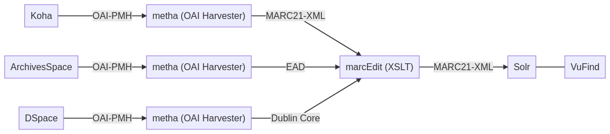
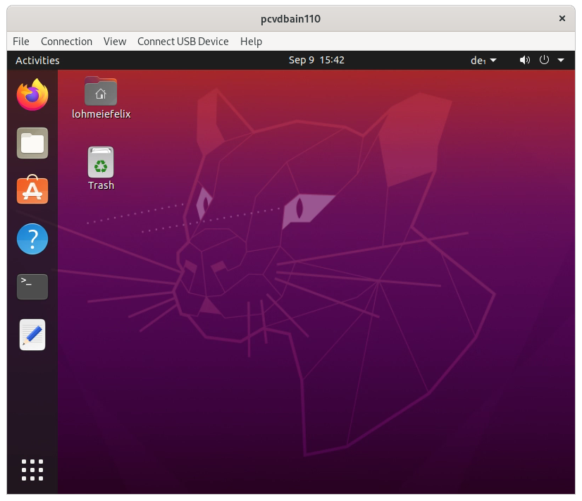

# Technische Grundlagen

* Schaubild zu Lehrinhalten (10 Minuten)
* Einrichtung der Arbeitsumgebung (Linux) (20 Minuten)
* Grundlagen der Unix Shell (45 Minuten)
* Versionskontrolle mit git (45 Minuten)
* Blog mit GitHub Pages (15 Minuten)

# Schaubild zu Lehrinhalten



erstellt mit [mermaid](https://mermaidjs.github.io/mermaid-live-editor/)

Note:

* In diesem Schaubild sind links die Lokalsysteme (Bibliothekssytem Koha, Archivinformationssystem ArchivesSpace, Repository-Software DSpace) aufgeführt. Diese bieten jeweils eine OAI-Schnittstelle an.
* Mit einer speziellen Software (hier: metha) werden die Metadaten im jeweils spezifischen Format eingesammelt. Über einen XSLT Crosswalk werden die Daten dann einheitlich in MARC21-XML überführt.
* Abschließend werden die MARC21-XML-Daten in die Discovery-Lösung VuFind eingespielt.
* Wir lernen die Systeme, Schnittstellen, Tools und Formate Schritt für Schritt kennen. Am Ende des Kurses sollten Sie das Schaubild dann in eigenen Worten erklären können.

# Einrichtung der Arbeitsumgebung (Linux)

## Arbeitsumgebung

* Jede/r erhält eine virtuelle Maschine der FH Graubünden mit Ubuntu Linux.
* Sie haben volle Administrationsrechte.
* Dozenten haben zur Unterstützung und Fehlerbehebung ebenfalls Zugriff darauf.

## Linux

* Die meisten Webserver laufen auf Linux.
* Wir verwenden [Ubuntu](https://ubuntu.com) in der Version 20.04 LTS.
* Ubuntu basiert wiederum auf [Debian](https://www.debian.org). Die ganze Familiengeschichte: [GNU/Linux Distributions Timeline](https://upload.wikimedia.org/wikipedia/commons/1/1b/Linux_Distribution_Timeline.svg)

Note:
- Normalerweise werden Linux-Server aus Sicherheitsgründen ohne grafische Oberfläche administriert, also nur über die Kommandozeile.

## Zugriff auf die virtuelle Maschine

1. Per VPN mit dem Netzwerk der FHGR verbinden
2. <https://horizon.fh-htwchur.ch> aufrufen
3. Zugriff auf die virtuelle Maschine (Ubuntu) entweder direkt über den Browser (HTML5) oder über eine Zusatzsoftware (Horizon Client)

Sie können sich an allen drei Punkten (VPN, Horizon und Ubuntu) mit Ihrem persönlichen FHGR-Konto anmelden.

Note:
- Bei Eingabe des Passworts ggf. mit Copy & Paste arbeiten, um Probleme mit dem Tastaturlayout zu umgehen.
- Copy & Paste funktioniert besser mit der Zusatzsoftware.

## Übung: Verbindung testen

Bitte verbinden Sie sich jetzt mit der virtuellen Maschine. Nach dem Login sollte es etwa so aussehen:



## Grundeinstellungen

1. Favoriten
    * Unten links Anwendungsmenü öffnen
    * Programm suchen (`Terminal` und `Text Editor`)
    * Rechtsklick auf Icon und `Add to Favorites` wählen

2. Startseite im Firefox Browser
    * Die [Übersichtsseite des gemeinsamen Dokuments](https://pad.gwdg.de/Tf-htntTR8COelT3Wgodzg?both#) aufrufen
    * Icon vor der URL (Schloss) per Drag & Drop auf Home-Button ziehen

Note:
- Teilnehmer\*innen mit Mac? Dann im Applikationsmenü "Region & Language" und dort das Keyboard Layout "German (Switzerland, Macintosh)" ergänzen und auswählen

## Programme installieren

1. Programmverzeichnis aktualisieren

    ```shell
    sudo apt update
    ```

2. Programme installieren

    ```shell
    sudo apt install git curl
    ```

Note:
- Darauf folgt eine Passwortabfrage (nochmal das gleiche).
- Änderungen werden ausführlich angezeigt, diese müssen dann nochmal mit `Y` bestätigt werden.
- Die Paketverwaltung unter Linux ist vergleichbar mit einem App-Store von Apple oder Google.

# Grundlagen der Unix Shell

* Wird benötigt zur Administration von Servern
* Ist aber auch zur Automatisierung von kleineren Aufgaben beliebt (Shell-Scripte)

Note:
- Die Unix Shell werden wir im Kurs öfter für Installation und Konfiguration der Software verwenden. Daher beginnen wir hier mit einer Wiederholung der wichtigsten Kommandos, damit uns das später leichter fällt.
- Es gibt verschiedene Varianten der Shell. Ubuntu verwendet Bash.

## Download der Materialien

1. In das Home-Verzeichnis wechseln

    ```shell
    cd
    ```

2. Archiv shell-lesson.zip von Library Carpentry herunterladen

    ```shell
    wget https://librarycarpentry.org/lc-shell/data/shell-lesson.zip
    ```

3. Archiv in den Ordner shell-lesson entpacken und Archiv löschen

    ```shell
    unzip shell-lesson.zip -d shell-lesson
    rm shell-lesson.zip
    ```

## Übungen

Aufgaben:

1. Bearbeiten Sie das zweite Kapitel [Navigating the filesystem](https://librarycarpentry.org/lc-shell/02-navigating-the-filesystem/index.html) der Library Carpentry Lesson zur Unix Shell
2. Bearbeiten Sie das dritte Kapitel [Working with files and directories](https://librarycarpentry.org/lc-shell/03-working-with-files-and-folders/index.html) der Library Carpentry Lesson zur Unix Shell

## Fragen?

* Copy & Paste im Terminal
  * probieren Sie Rechtsklick
  * Tastaturkürzel im Terminal: STRG+SHIFT+C und STRG+SHIFT+V
  * Linux-weit funktioniert Paste mit SHIFT+EINFÜGEN
* Probleme beim Netzwerkzugriff
  * müssen wir beim IT-Support anfragen

## Tipps zur Unix Shell

* Nutzen Sie immer die Tab-Taste für die Autovervollständigung.
* Seien Sie faul, verwenden Sie Ihre persönliche Befehlshistorie (Pfeiltaste nach oben / Suche in der Historie mit `STRG`+`R`).
* Wichtig ist die Unterscheidung zwischen Programm (`ls`) und Parametern (`-l`).
* Nutzen Sie Spickzettel für die wichtigsten Kommandos wie z.B. [Library Carpentry Reference](https://librarycarpentry.org/lc-shell/reference.html) oder [Cheatsheet für Shell-Scripte](https://devhints.io/bash).

Note:
- Alle Programme in der Unix Shell sind ähnlich aufgebaut. Wenn Sie das Grundprinzip mit der Unterscheidung von Programm und Parametern verinnerlicht haben, dann hilft Ihnen auch die integrierte Hilfe (`--help`) weiter.

## Redirects und Pipes


Note:
1. Bei einer normalen Eingabe landet das Ergebnis im Terminal. `wc` steht für "word count" und liefert mit dem Parameter `-l` die Anzahl der Zeilen. Die Angabe `*.tsv` bedeutet alle Dateien mit der Dateiendung "tsv".
2. Stattdessen kann das Ergebnis aber auch in eine Datei umgelenkt werden mit der spitzen Klammer `>`
3. Das Ergebnis eines Programms kann mit "Pipes" (`|`) direkt weiterverarbeitet werden. Welche Ausgabe erwarten Sie?

# Versionskontrolle mit git

(folgt)

# Blog mit GitHub Pages

* Mit GitHub Pages lassen sich statische Webseiten direkt aus den Dateien im GitHub Repository generieren und auf Servern von GitHub kostenfrei veröffentlichen.
* GitHub verwendet dazu den (hauseigenen) Static-Site-Generator [Jekyll](https://help.github.com/en/github/working-with-github-pages/about-github-pages-and-jekyll).
  * Die Software nimmt Markdown- und HTML-Dateien und generiert daraus eine komplette Webseite.
  * Die Darstellung (Themes) lässt sich über eine Konfigurationsdatei einstellen.

# Aufgabe: Lerntagebuch

Bis zum nächsten Termin:

1. Lerntagebuch einrichten
   * Vorlage für ein Lerntagebuch mit GitHub Pages: <https://github.com/felixlohmeier/lerntagebuch>
   * Link bitte auf der Übersichtsseite der gemeinsamen Dokumente ergänzen: <https://pad.gwdg.de/Tf-htntTR8COelT3Wgodzg>
2. Einführungsartikel (wo bin ich gestartet?)
3. Beitrag zu dieser Lehreinheit "Technische Grundlagen"
