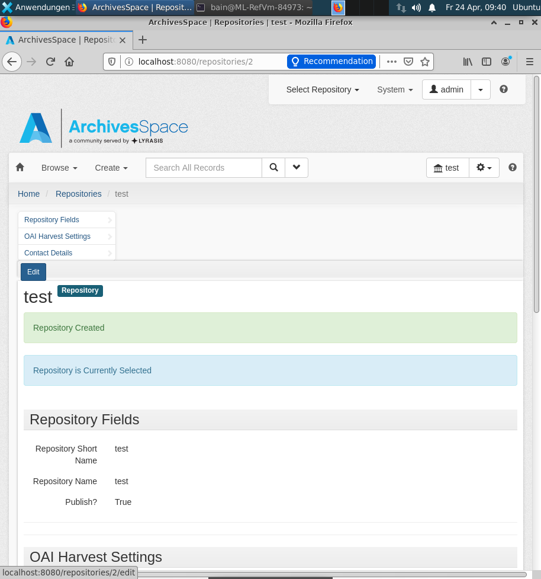

# Funktion und Aufbau von Archivsystemen

* Metadatenstandards in Archiven (ISAD(G) und EAD) (45 Minuten)
* Installation und Konfiguration von ArchivesSpace (125 Minuten)
* Marktüberblick Archivsysteme (10 Minuten)

## Metadatenstandards in Archiven (ISAD(G) und EAD)

1. ISAD(G) (15 Minuten)
2. Übung Archivkataloge (20 Minuten)
3. EAD (5 Minuten)
4. Aktuelle Entwicklungen (5 Minuten)

### ISAD(G)

* Als digitale Archivsysteme entwickelt wurden, orientierte sich die Datenstruktur an analogen Findmitteln wie Findbüchern und Zettelkästen.
* Ein wichtiger Verzeichnungsstandard im Archivwesen wurde 1994 (Revision 2000) eingeführt, die "International Standard Archival Description (General)" - kurz [ISAD(G)](https://de.wikipedia.org/wiki/ISAD(G)).
* Grundsätzlich gibt es hier eine mehrstufige Verzeichnung im Provenienzprinzip, um den Entstehungszusammenhang abzubilden.

#### Informationsbereiche

Der Standard enthält 26 Verzeichnungselemente in 7 Informationsbereichen:

1. Identifikation
2. Kontext
3. Inhalt und innere Ordnung
4. Zugangs- und Benutzungsbedingungen
5. Sachverwandte Unterlagen
6. Anmerkungen
7. Kontrolle

#### Pflichtfelder

Von besonderer Bedeutung sind 6 Pflichtfelder:

* Signatur
* Titel
* Provenienz
* Entstehungszeitraum
* Umfang
* Verzeichnungsstufe

#### Grenzen von ISAD(G)

1. Ein einzelner Datensatz ist unter Umständen nur im Kontext verständlich (z. B. nur "Protokoll" als Titel).
2. Die Tektonik ist eindimensional (keine Mehrfachzuordnung möglich).
3. Der Standard enthält keine Vorgaben zur Digitalisierung oder zur digitalen Langzeitarchivierung.

#### Normdaten mit ISAD(G)

* Um Normdateien verzeichnen zu können, wurde später ein ergänzender Standard "International Standard Archival Authority Record for Corporate Bodies, Persons, and Families" - kurz [ISAAR(CPF)](https://de.wikipedia.org/wiki/ISAAR%28CPF%29) verabschiedet. Dieser wird in der Praxis wegen dem Zusatzaufwand bei der Erschließung jedoch nur selten verwendet.
* Aktuell ist ein neuer Standard ["Records in Contexts" (RIC)](https://de.wikipedia.org/wiki/Records_in_Contexts) in Entwicklung. Dieser basiert auf Linked-Data-Prinzipien und soll neue und mehrfache Beziehungen zwischen Entitäten ermöglichen.

Note:
* In den Archiven der ETH-Bibliothek ist wegen der Bibliothekszugehörigkeit die [GND](https://de.wikipedia.org/wiki/Gemeinsame_Normdatei)-ID von besonderer Bedeutung.
* Projektgruppe [ENSEMEN](https://vsa-aas.ch/arbeitsgruppen/projektgruppe-ensemen/) arbeitet an einer schweizerischen Ausprägung des neuen Standards [Records in Contexts](https://www.ica.org/en/records-contexts-german) (RiC), mit Beteiligung von Niklaus Stettler (FH Graubünden)

### Übung: Archivkataloge

**Aufgabe (20 Minuten):**

* Suchen Sie nach:
   * `Einstein` im [Online Archivkatalog des Staatsarchivs BS](https://query.staatsarchiv.bs.ch/query/suchinfo.aspx)
   * `Einstein Ehrat` im [Hochschularchiv ETH Zürich](http://archivdatenbank-online.ethz.ch/)
* Beantworten Sie die folgenden Fragen:
   1. Welche Informationen enthält die Trefferliste?
   2. Welche Verzeichnungsstufen sind vertreten?
   3. Sind die ISAD(G)-Informationsbereiche erkennbar?
   4. Decken sich die grundlegenden Informationen oder gibt es bemerkenswerte Unterschiede?
   5. Worin liegen die zentralen Unterschiede zu einem Bibliothekskatalog?
* Zum Nachschlagen: [ISAD(G) Guidelines](https://www.ica.org/sites/default/files/CBPS_2000_Guidelines_ISAD%28G%29_Second-edition_DE.pdf)

### EAD

* [Encoded Archival Description](https://de.wikipedia.org/wiki/Encoded_Archival_Description) (EAD) ist ein XML-Standard
* Verschiedene Versionen: EAD2002 und EAD3 (August 2015 veröffentlicht)
* Lässt viele Wahlmöglichkeiten offen, daher gibt es oft Anwendungsprofile, die genauer spezifizieren welche Werte zugelassen sind.
* Anwendungsfälle: [Archives Portal Europa](https://www.archivesportaleurope.net/de/), [Archivportal-D](https://www.archivportal-d.de), [Kalliope](https://kalliope-verbund.info)
* Einführung: [Nicolas Moretto (2014): EAD und digitalisiertes Archivgut](https://wiki.dnb.de/download/attachments/90410326/20140414_KIMWS_EAD.pdf?version=1&modificationDate=1398246420000&api=v2). Präsentation auf dem [DINI AG KIM Workshop 2014](https://wiki.dnb.de/display/DINIAGKIM/KIM+WS+2014) in Mannheim.

Note:
* Wir werden später praktisch mit EAD-Dateien arbeiten, daher hier nur diese Kurzinfo.
* Die Präsentationsfolien von Nicolas Moretto geben einen guten Überblick über EAD2002.
* Liste der Elemente in EAD2002: https://eadiva.com/2/elements/

### Aktuelle Entwicklungen

* Umstieg von ISAD(G) auf RiC wird mit viel Aufwand verbunden sein, auch mit einem Systemwechsel.
* Generierung von mehr Volltexten u.a. durch Optical Character Recognition (OCR) auch für Handschriften. Automatisierte Anreicherung von Volltexten durch Named Entity Recognition.
* In Wikidata werden Online-Findmittel über Property [Archives at](https://www.wikidata.org/wiki/Property:P485) verzeichnet. Beispiel [Albert Einstein in Wikidata](https://www.wikidata.org/wiki/Q937).
* In der Schweiz gibt es eine Vernetzungsinitiative [Metagrid](https://metagrid.ch) und weitere Dienste von [histHub](https://histhub.ch), einer Forschungsplattform für die Historischen Wissenschaften.
* Literaturempfehlung: [Umfrage "Was sich Historiker\*innen von Archiven wünschen"](https://dhdhi.hypotheses.org/6107)

## Installation und Konfiguration von ArchivesSpace

1. Einführung in ArchivesSpace (10 Minuten)
2. Exkurs zur Systemadministration (5 Minuten)
3. Installation ArchivesSpace (30 Minuten)
4. Bedienung (45 Minuten)
5. Import und Export (30 Minuten)
6. Literatur zu ArchivesSpace (5 Minuten)

### Einführung in ArchivesSpace

* Open-Source-Software für Archivinformationssysteme
* 400 zahlende [Mitglieder](http://archivesspace.org/community/whos-using-archivesspace/), woraus fast 5 Vollzeitstellen finanziert werden.
* Code bei GitHub: <https://github.com/archivesspace/archivesspace>
* ArchivesSpace ist institutionell verankert bei [Lyrasis](https://en.wikipedia.org/wiki/Lyrasis), einem internationalen "nonprofit" Bibliotheksnetzwerk vorrangig aus den USA. Es gibt auch zwei weitere Unternehmen, die dazu professionellen Support anbieten.

#### Funktionen

"What ASpace does and how do we use it" ([aus Fortbildungsmaterialien der NYU](https://guides.nyu.edu/ld.php?content_id=23461999))
* System of record for archival materials. Not everything is public, or open to staff, nor is it intended to be.
* Perform core archival functions: accessioning, arrangement and description
* Aid in public services
* Record and report location holdings information; stacks management
* Manage digital objects
* Produce access tools
* Statistics gathering, prioritization, holistic planning
* Contribute to various interdepartmental processes (preservation and digitization)

#### Metadaten in ArchivesSpace

* basiert auf den Standards [DACS](https://en.wikipedia.org/wiki/Describing_Archives:_A_Content_Standard), ISAD(G) und ISAAR(CPF)
* unterstützt Import/Export in EAD, MARCXML und METS

### Exkurs zur Systemadministration

Wir haben auf unserem Server bereits Koha installiert. Gibt es Probleme wenn wir ArchivesSpace zusätzlich installieren?
* Es könnten Versions- oder Ressourcenkonflikte entstehen.
* Best Practice: Jedes System in einer eigenen Umgebung.
* Koha und ArchivesSpace vertragen sich aber zufällig gut, daher installieren wir hier ArchivesSpace einfach zusätzlich.

Note:
* Es könnte Konflikte geben, wenn die Systeme unterschiedliche Versionen der gleichen Programmiersprache (z.B. Java, PHP) oder der Datenbank (z.B. MySQL, PostgreSQL) benötigen. Es könnten auch die Ressourcen (insbesondere Arbeitsspeicher) knapp werden.
* Um den Wartungsaufwand zu reduzieren und Ressourcen zu sparen, werden üblicherwese virtuelle Maschinen oder Container eingesetzt.

### Installation ArchivesSpace

Wir werden nun ArchivesSpace auf den virtuellen Maschinen installieren.

1. Installation ArchivesSpace 2.7.1
2. Staff Interface aufrufen
3. Exkurs: Konfigurationsmöglichkeiten
4. Grundkonfiguration

#### Installation ArchivesSpace 2.7.1

1. Java 8 installieren

    ```bash
    sudo apt update
    sudo apt install openjdk-8-jre-headless
    ```

2. Zip-Archiv herunterladen und entpacken

    ```bash
    wget https://github.com/archivesspace/archivesspace/releases/download/v2.7.1/archivesspace-v2.7.1.zip
    unzip -q archivesspace-v2.7.1.zip
    ```

3. ArchivesSpace starten

    ```bash
    archivesspace/archivesspace.sh
    ```

Note:
* Während Koha in der Standardinstallation so eingerichtet ist, dass es automatisch beim Systemstart zur Verfügung steht, muss ArchivesSpace in der Standardinstallation manuell gestartet werden.
* Es ist nur solange verfügbar wie der Prozess im Terminal läuft. Es handelt sich um eine Webanwendung. Im Terminal läuft die Server-Applikation. Über den Browser greifen wir darauf zu. Wenn das Terminal geschlossen wird, dann wird auch der Server beendet und die Webseite im Browser ist nicht mehr erreichbar.

#### Staff Interface aufrufen

Nach ein paar Minuten sollte ArchivesSpace unter folgenden URLs erreichbar sein:

* http://localhost:8080/ – the staff interface
* http://localhost:8081/ – the public interface
* http://localhost:8082/ – the OAI-PMH server
* http://localhost:8089/ – the backend
* http://localhost:8090/ – the Solr admin console

Zugangsdaten für das "Staff Interface" sind:

* Username: `admin`
* Password: `admin`

Note:
* Da es sich um eine lokale Installation handelt, sind die Adressen nur über den Webbrowser innerhalb der Virtuellen Maschine erreichbar.

#### Exkurs: Konfigurationsmöglichkeiten

* Spracheinstellung: Es gibt noch keine deutsche Übersetzung aber Spanisch, Französisch und Japanisch
  * Konfiguration: <https://archivesspace.github.io/archivesspace/user/configuring-archivesspace/#Language>
  * Sprachdateien: <https://github.com/archivesspace/archivesspace/tree/master/common/locales>
* Weitere Optionen: Siehe technische Dokumentation <https://archivesspace.github.io/archivesspace/user/configuring-archivesspace/>

#### Grundkonfiguration

Nach dem ersten Login erscheint die Meldung:

> To create your first Repository, click the **System** menu above and then **Manage Repositories**.

Dort nutzen Sie den Button `Create Repository` um ihr Repository anzulegen.

* Notwendig sind zunächst nur `Repository Short Name` und `Repository Name`.
* Die Checkbox `Publish?` definiert, ob die Daten im "public interface" unter http://localhost:8081 erreichbar sind.

#### Beispiel



### Bedienung

Wir nutzen nun die zuvor diskutierten Grundlagen und die Erfahrungen aus der Übung zu "Einstein", um Datensätze in ArchivesSpace zu erschließen.

Versuchen Sie bei der folgenden Gruppenarbeit intuitiv vorzugehen und tauschen Sie sich untereinander aus.

#### Übung: Datensätze erstellen

**Aufgabe (40 Minuten)**

* Aufgabe: Erstellen Sie eigene Datensätze in Ihrer ArchivesSpace Installation. Erfinden Sie dazu sinnvolle Archivdaten oder suchen Sie sich Beispieldaten (z.B. im [Hochschularchiv der ETH](http://archivdatenbank-online.ethz.ch)).
* Ziel: Ihre Datensätze erscheinen in der öffentlichen Ansicht unter http://localhost:8081. Machen Sie einen Screenshot und laden Sie das Bild hier in das gemeinsame Dokument.
* Hinweis: Orientieren Sie sich beim Vorgehen an der Übung der NYU: [Create Your Own Record](https://guides.nyu.edu/ld.php?content_id=23198351)

### Import und Export

ArchivesSpace bietet dateibasierten Import und Export in diversen Formaten (EAD, MARCXML, CSV) und auch eine OAI-PMH-Schnittstelle (diese lernen wir später noch kennen).

In den folgenden zwei Übungen werden wir die vorhin selbst erstellten Daten in MARCXML exportieren und EAD-Beispieldaten in ArchivesSpace importieren.

#### Übung: Export

**Aufgabe (10 Minuten)**

* Aufgabe: Exportieren Sie die von Ihnen eingegebenen Datensätze im Format MARCXML. Vergleichen Sie die exportierte XML-Datei kurz mit den in ArchivesSpace vorhandenen Informationen. Ist der Export in MARCXML verlustfrei?
* Ziel: Dokumentieren Sie Ihre Erkenntnisse unten im gemeinsamen Dokument.
* Hinweis: Die Export-Funktion finden Sie etwas versteckt in der Button-Leiste bei einzelnen Datensätzen.

Note:
* Mappingtabellen als XLS (Stand 2013, unklar ob aktuell) stellt ArchivesSpace auf der Webseite zur Verfügung: <https://archivesspace.org/using-archivesspace/migration-tools-and-data-mapping>
* Technische Dokumentation der Konvertierung in MARCXML (falls jemand die Proogrammiersprache Ruby können sollte): https://archivesspace.github.io/archivesspace/doc/MarcXMLConverter.html

#### Übung: Import

**Aufgabe (15 Minuten)**

* Beispieldaten: https://eadiva.com/2/sample-ead2002-files/ (laden Sie eine der als "a raw XML file" verlinkten Dateien herunter)
* Aufgabe: Importieren Sie Beispieldaten im Format EAD in ArchivesSpace. Vergleichen Sie die Anzeige in ArchivesSpace mit der bei den Beispieldaten verlinkten HTML-Ansicht.
* Ziel: Dokumentieren Sie Ihre Erkenntnisse unten im gemeinsamen Dokument.
* Hinweis: Die Import-Funktion finden Sie etwas versteckt unter `Create` > `Background Job` > `Import Data`

Note:
* Import kann etwas länger dauern weil,
  * wir nur die mitgelieferte Datenbank (für Testzwecke) verwendet haben und keine separate MySQL-Datenbank
  * EAD ein komplexes Dateiformat ist, was etwas aufwendiger auszuwerten ist (daher auch die mehreren "Cycles" in der Log-Datei)
  * ArchivesSpace in der Grundeinstellung nur 1 GB RAM benutzt, siehe Dokumentation zu "Tuning": <http://archivesspace.github.io/archivesspace/user/tuning-archivesspace/>

### Literatur zu ArchivesSpace

* Einführungsvideos: https://www.youtube.com/playlist?list=PL3cxupmXL7WiXaHnpVquPrUUiLiDAMhg0
* ArchivesSpace Wiki: https://archivesspace.atlassian.net/wiki/spaces/ADC/
* ArchivesSpace Manual for Local Usage at NYU: https://docs.google.com/document/d/11kWxbFTazB6q5fDNBWDHJxMf3wdVsp8cd7HzjEhE-ao/edit#
* Workflow Overview bei Orbis Cascade Alliance (ArchivesSpace 1.5.2): https://www.orbiscascade.org/achivesspace-workflow-overview/

Note:
* Das Benutzerhandbuch von ArchivesSpace steht nur zahlenden Mitgliedern zur Verfügung. Bei Open-Source-Software suchen die Communities oft nach einem Zusatzvorteil für Mitglieder, weil die Software selbst ja kostenfrei erhältlich ist. Wirklich "open" ist diese Zurückhaltung von Informationen nicht so recht.

## Marktüberblick Archivsysteme

* ArchivesSpace hat eine große Community in den USA
* Weitere Open-Source-Alternative: [Access to Memory (Atom)](https://www.accesstomemory.org)
* Der Markt in der Schweiz wird von den Produkten [scope.Archiv](http://www.scope.ch) und [CMISTAR](https://www.cmiag.ch/cmistar) dominiert.
* Für die Online-Präsentation von digitalisiertem Archivgut wird oft zusätzliche Software eingesetzt. Beispiele:
  * [E-Pics Plattform der ETH Zürich](https://www.e-pics.ethz.ch)
  * [e-manuscripta.ch - Kooperative Präsentationsplattorm für handschriftliche Quellen](http://www.e-manuscripta.ch)

Note:
* In den Archiven der ETH-Bibliothek wird CMI STAR verwendet. Im "Rich-Client" (Programm für die Mitarbeiter\*innen) wird die Erschließung anhand der ISAD(G) Informationsbereiche kategorisiert. CMI STAR beinhaltet auch ein grafisches Mapping-Tool für den Import von Excel oder CSV. Das wird verwendet, um Eingaben von Hilfskräften in Excel in das System zu importieren.

### Unterschiede zwischen Bibliotheks- und Archivsystemen

* Bibliothek
  * Medium, Benutzerinteraktion (Ausleihe)
  * Software medienzentriert
  * Metadatenformat: MARC21, zukünftig BIBFRAME?
* Archiv
  * Entstehungszusammenhang, eher stehender Bestand (auf Anfrage)
  * Software orientiert sich an analogen Findmitteln
  * Metadatenformat: EAD, zukünftig RiC

Note:
* Herausforderung: Datenaustausch zwischen den Systemen (kommen wir später darauf zurück)
