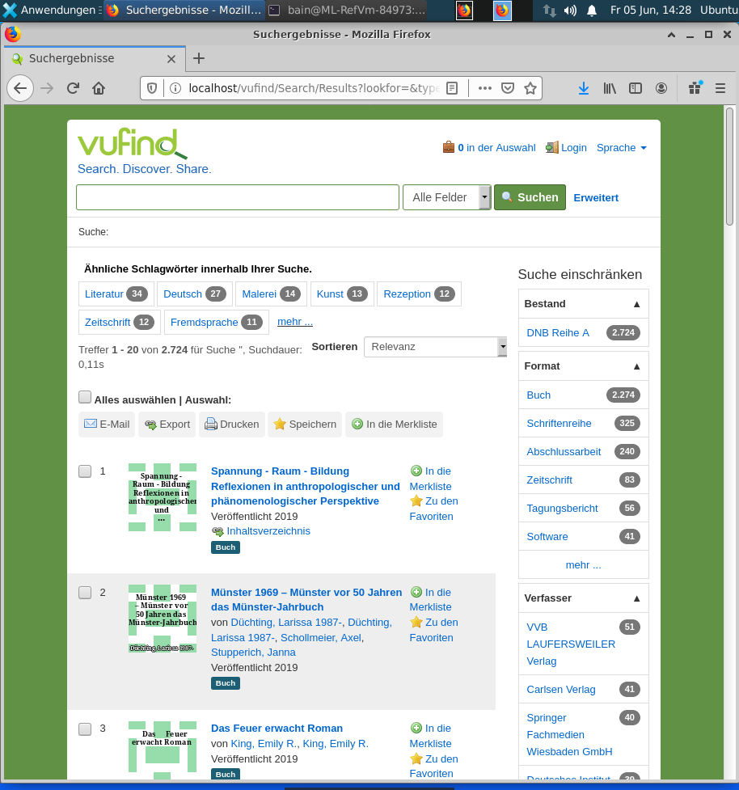

# Suchmaschinen und Discovery-Systeme

1. Funktion von Suchmaschinen am Beispiel von Solr (15 Minuten)
2. Installation und Konfiguration von VuFind (120 Minuten)
3. Marktüberblick Discovery-Systeme (15 Minuten)

## Funktion von Suchmaschinen am Beispiel von Solr

**Aufgabe (ca. 2 Stunden):** [Solr Tutorial](https://lucene.apache.org/solr/guide/8_5/solr-tutorial.html)

### Zur Einordnung von Solr

* Solr ist zusammen mit Elasticsearch quasi "Industriestandard".
* Solr kann verschiedene Dateiformate (.doc, .xml .json, .ppt usw.) importieren.
* Üblicherweise sollte vor dem Import der Daten in einem Schema festgelegt werden welche Felder existieren und welche Datentypen diese beinhalten dürfen.
* Solr hat zwar eine integrierte Suchoberfläche, aber diese ist nur zu Demo-Zwecken gedacht.
* Das Discovery-System VuFind basiert auf Solr (ebenso wie viele kommerzielle Lösungen wie z.B. Ex Libris Primo).

## Installation und Konfiguration von VuFind

* VuFind Internetseite: <https://vufind.org>
* VuFind Code bei GitHub: <https://github.com/vufind-org/vufind>
* Deutsche VuFind Anwendergemeinschaft: <https://vufind.de>
* Präsentation “10 Jahre VuFind” (2017): <https://felixlohmeier.de/slides/2017-09-28_vufind-anwendertreffen-keynote.html>
* VuFind-Installationen weltweit: <https://vufind.org/wiki/community:installations>
  * Beispiel TU Hamburg: <https://katalog.tub.tuhh.de>
  * Beispiel UB Leipzig: <https://katalog.ub.uni-leipzig.de>

### Installation

Gemeinsame Installation nach offizieller Anleitung für VuFind unter Ubuntu: <https://vufind.org/wiki/installation:ubuntu>

Es folgen die relevanten Auszüge und Hinweise/Erklärungen dazu.

#### VuFind on Ubuntu

> These instructions assume that you are starting with a clean installation of Ubuntu. If you already have an Ubuntu server, you will be able to skip some steps, but you may have to reconfigure some existing software.

Zur Erinnerung: Best Practice ist die Installation von einer Anwendung pro Server (durch Virtualisierung und Container heute einfach möglich).

#### Version Requirements

> These instructions were most recently tested on Ubuntu 19.10 and Debian 10.1 (...)

Gut für uns, weil wir für unsere virtuelle Maschine Ubuntu Server 19.10 verwenden.

#### Installing VuFind from the DEB Package

> The easiest way to get VuFind up and running is to install it from the DEB package.

VuFind stellt ein Installationspaket bereit. Unter Linux gibt es viele verschiedene Formate für Installationspakete. Für Ubuntu und Debian gibt es DEB, für Fedora und SUSE beispielsweise RPM.

```
wget https://github.com/vufind-org/vufind/releases/download/v6.1.1/vufind_6.1.1.deb
sudo dpkg -i vufind_6.1.1.deb
sudo apt-get install -f
```

#### Important Notes / Database Issues

Hier ist ein Fehler in der Anleitung. Ubuntu Server 19.10 wird mit MariaDB ausgeliefert und nicht mit MySQL. Für uns ist daher "Case 4 - MariaDB" relevant.

#### MariaDB Passwort für root

> If you are using a distribution that includes MariaDB instead of MySQL, you will not be prompted to set a root password during installation. Instead, you should run “sudo /usr/bin/mysql_secure_installation” to properly set up security.

```
sudo /usr/bin/mysql_secure_installation
```

* Das aktuelle Passwort ist leer (Enter drücken).
* Die voreingestellten Antworten sind ok (alle Fragen können mit Enter bestätigt werden).

#### MariaDB Zugriff auf root erlauben

> (...) you may also need to disable the root account's “unix_socket” plugin, which prevents regular logins. You can do this by logging in with “sudo mysql -uroot -p” and then running "UPDATE mysql.user SET plugin='' WHERE User='root'; FLUSH PRIVILEGES;"

1. MySQL Administration öffnen (und Passwort eingeben)
    ```
    sudo mysql -uroot -p
    ```
2. Konfigurationsbefehl eingeben
    ```
    UPDATE mysql.user SET plugin='' WHERE User='root'; FLUSH PRIVILEGES;
    ```
3. MySQL Administration schließen
    ```
    exit;
    ```
#### Important Notes / (Ende)

> You may want to restart your system one more time to be sure all the new settings are in place, or at least make sure appropriate environment variable settings are loaded by running: `source /etc/profile`

Ein Neustart ist in unserem Fall nicht erforderlich. Es reicht aus, den genannten Befehl einzugeben:

```
source /etc/profile
```

#### Configuring and starting VuFind / Start solr

```
cd /usr/local/vufind/
./solr.sh start
```

Die Warnungen zu den Limits können erstmal ignoriert werden. In der Doku von VuFind ist beschrieben, wie sich das korrigieren ließe: <https://vufind.org/wiki/administration:starting_and_stopping_solr>

#### Configuring and starting VuFind / Configure VuFind

> Open a web browser, and browse to this URL: <http://your-server-name/vufind/Install/Home> (Replace “your-server-name” with the address you wish to use to access VuFind; replace “vufind” with your custom base path if you changed the default setting during installation).

Wir haben keinen Domainnamen. Daher verwenden wir `localhost`. Öffnen Sie den Browser in der virtuellen Maschine (Linux) und rufen Sie die folgende Adresse auf:

<http://localhost/vufind/Install/Home>

#### Configuring and starting VuFind / Auto-Configuration

> If installation was successful, you should now see an Auto Configure screen. Some items on the list will be marked “Failed” with “Fix” links next to them. Click on each Fix link in turn and follow the on-screen instructions. (...) After an issue is successfully resolved, you can click the “Auto Configure” breadcrumb to go back to the main list and proceed to the next problem.

Die meisten Punkte können ohne weitere Angaben "gefixt" werden. Nur die beiden Punkte Database und ILS erfordern weitere Angaben.

#### Configuring and starting VuFind / Auto-Configuration / Database

Bei der Datenbank muss ein neues Passwort vergeben und das zuvor oben im Abschnitt "MariaDB Passwort für root" eingegeben werden.

#### Configuring and starting VuFind / Auto-Configuration / ILS

Wir haben kein Bibliothekssystem, daher wählen wir NoILS. Dann wird aber trotzdem noch "Failed" angezeigt und wenn wir nochmal auf "Fix" klicken erscheint die folgende Meldung:

> (...) You may need to edit the file at /usr/vufind/local/config/vufind/NoILS.ini

1. Datei mit Texteditor nano öffnen
```
sudo nano /usr/local/vufind/local/config/vufind/NoILS.ini
```
2. In Zeile 3 `ils-offline` in `ils-none` ändern.

3. nano beenden mit CTRL+X und bestätigen (y)


#### Weitere Sicherheitseinstellungen

Die in den Abschnitten [Locking Down Configurations](https://vufind.org/wiki/installation:ubuntu#locking_down_configurations) und [4. Secure your system](https://vufind.org/wiki/installation:ubuntu#secure_your_system) beschriebenen Einstellungen benötigen wir für unsere Testinstallation nicht.

#### Falls etwas schief geht...

* Bei Mehreren ist das Problem aufgetreten, dass die Seite "Auto Configuration" nicht mehr geladen werden konnte. Auch ein Drüberinstallieren und Entfernen und Neuinstallieren von VuFind hat nicht geholfen.
* Ursache: Lokale Konfiguration (im Verzeichnis /usr/local/vufind/local/) wird beim Drüberinstallieren und Entfernen nicht angetastet.
* Lösung: Lokale Konfigurationsdatei manuell löschen
  ```
  sudo rm /usr/local/vufind/local/config/vufind/config.ini
  ```
* Danach ist die Seite "Auto Configuration" wieder aufrufbar.

## Konfiguration

Gruppenarbeit: Bearbeiten Sie die Kapitel 4-9 von folgendem Tutorial: https://felixlohmeier.gitbooks.io/vufind-tutorial-de/content/04_Installation_Testimport.html

Das Tutorial wurde ursprünglich von Stefan Niesner im Rahmen einer [Projektarbeit](http://malisprojekte.web.th-koeln.de/wordpress/stefan-niesner/) entwickelt und von mir für VuFind 4.1 aktualisiert.

#### Hinweise

* Der Befehl zum Kopieren der facets.ini schlägt fehl (`cp /usr/local/vufind/config/vufind/facets.ini /usr/local/vufind/local/config/vufind`). Es hilft ein Kopieren mit Administrationsrechten (`sudo` voranstellen). Gleiches gilt für die Bearbeitung der Konfigurationsdateien (`sudo` voranstellen).
* Das Ändern der Sprache funktioniert ggf. nur, wenn `browserDetectLanguage` auf `false` gesetzt wird.
* Kapitel 7 scheitert mit einem "Permission denied", hier muss das Tutorial überarbeitet werden. Bitte dieses Kapitel überspringen.

#### Ergebnis

So sollte es aussehen, wenn die Kapitel 4-9 des Tutorials bearbeitet wurden:



## Marktüberblick Discovery-Systeme

### International

Jährlicher Library Systems Report von Marshall Breeding im ALA Magazine: <https://americanlibrariesmagazine.org/2020/05/01/2020-library-systems-report/>

Anhängende Statistik gibt einen guten Überblick:
<https://americanlibrariesmagazine.org/wp-content/uploads/2020/04/charts-for-2020-Library-Systems-Report.pdf>

### Schweiz: SLSP

Durch [SLSP](https://slsp.ch) wird Ex Libris Alma und damit in der Regel auch das dazu gehörige Discovery-System Primo an den wissenschaftlichen Bibliotheken in der Schweiz eingeführt.
