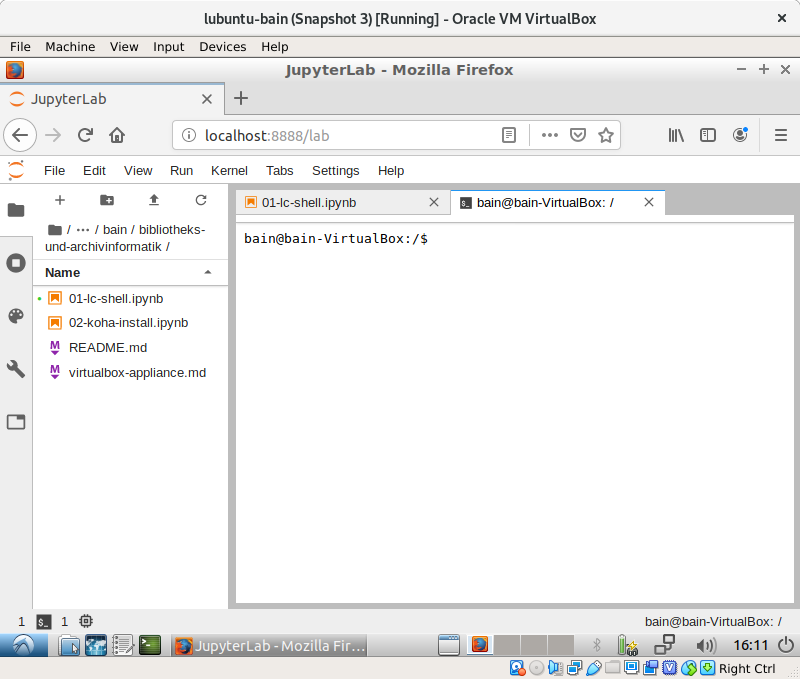

# Skript zum Kurs "Bibliotheks- und Archivinformatik"

Dieses Skript entsteht in der Zeit von September 2019 bis Januar 2020 im Rahmen der folgenden Lehrveranstaltung:

- Kurs "Bibliotheks- und Archivinformatik"
- Dozent: [Felix Lohmeier](http://felixlohmeier.de)
- Herbstsemester 2019
- Lehrauftrag an der [FH Graubünden - Studiengang Information Science](https://www.fhgr.ch/studium/bachelorangebot/wirtschaft-und-dienstleistung/information-science/)
- Bachelor, 4. Semester, 4 ECTS

## Arbeitsumgebung

Wir nutzen eine vorkonfigurierte Arbeitsumgebung mit [Lubuntu 18.04 LTS](https://lubuntu.me/) und [JupyterLab](https://jupyterlab.readthedocs.io).

### Option 1: VirtualBox

Die Software [VirtualBox](https://www.virtualbox.org/) ermöglicht es Ihnen, verschiedene Arbeitsumgebungen auf Ihrem Computer zu installieren, ohne dass Ihr gewohntes Betriebssystem verändert wird. VirtualBox ist kostenfrei für Windows, macOS und Linux erhältlich.

Laden Sie VirtualBox von der Webseite herunter, installieren Sie das Programm und importieren Sie dann die folgende Virtual Appliance: [lubuntu-jupyter-bain.ova](https://drive.switch.ch/index.php/s/DI5qngSao8SOs9b) (2,4 GB)

* user: `bain`
* pass: `bain2019`

### Option 2: Booten von USB-Stick

In einigen Fällen erfüllen die mitgebrachten Laptops nicht die Anforderungen (2 GB freier Arbeitsspeicher, 20 GB freier Festplattenspeicher, Unterstützung für Hardware-Virtualisierung VT-X oder AMD-V) für die bereitgestellte VirtualBox Appliance. Meist lässt sich dies durch eine Konfiguration (Festplatte aufräumen, Aktivierung VT-X / AMD-V in der UEFI-Firmware, Deinstallation von Windows-Feature Hyper-V) beheben.

Für die verbleibenden Fälle, in denen VirtualBox nicht verwendet werden kann, werden bootfähige USB-Sticks bereitgestellt, auf denen die gleiche Arbeitsumgebung installiert ist wie in der VirtualBox Appliance.

### Gemeinsames Dokument

Für Notizen und zum Austausch verwenden wir ein gemeinsames Dokument in einer [CodiMD](https://github.com/codimd/server)-Installation [bei der GWDG](https://pad.gwdg.de/). Alle, die den Link kennen, können es bearbeiten. Zur Formatierung wird [Markdown](https://de.wikipedia.org/wiki/Markdown) verwendet.

* [Gemeinsames Dokument](https://pad.gwdg.de/7X8eCDVoQB2Ng6DZlG40LQ?both)

## Inhalte

1. 25.09.2019: Installation und Grundlagen
   - Vorstellungsrunde und Organisatorisches
   - Einführung in Markdown (und CodiMD)
     - [Markdown Tutorial](https://www.markdowntutorial.com/)
   - Einführung in die Arbeitsumgebung JupyterLab
   - Einführung in die Kommandozeile
     - Installation: [Vorschau mit nbviewer](https://nbviewer.jupyter.org/github/felixlohmeier/bibliotheks-und-archivinformatik/blob/master/01-lc-shell.ipynb)
     - [Library Carpentry: The UNIX Shell](https://librarycarpentry.org/lc-shell/) (Kapitel 2, 3 und 5)
   - Aufgabe: Blog einrichten für Lerntagebuch
2. 09.10.2019: Bibliothekssystem Koha
   - Einführung in Virtualisierungstechnologien
   - VirtualBox auf mitgebrachten Laptops installieren
   - Koha installieren und anwenden
     - Installation: [Vorschau mit nbviewer](https://nbviewer.jupyter.org/github/felixlohmeier/bibliotheks-und-archivinformatik/blob/master/02-koha-install.ipynb)
     - Tutorial von Stephan Tetzel (2018): [Wie man Koha installiert und für Schulen einrichtet](https://zefanjas.de/wie-man-koha-installiert-und-fuer-schulen-einrichtet-teil-1/) (Kapitel 1-6)
   - Metadatenstandards in Bibliotheken (hier MARC21)
   - Marktüberblick Bibliothekssysteme
     - Marshall Breeding: [Library Systems Report 2019](https://americanlibrariesmagazine.org/2019/05/01/library-systems-report-2019/)
   - Aufgabe bis 30.10.: Blogbeiträge zu Tag 1 und Tag 2
3. 30.10.2019: Archivsystem ArchivesSpace
   - Anwendungsfälle für Shell-Scripte
   - Feedback zu Lerntagebüchern
   - Metadatenstandards in Archiven (hier ISAD(g) und EAD)
   - Gastbeitrag zu Archiven der ETH-Bibliothek von Michael Gasser
   - ArchivesSpace installieren und anwenden
     - Installation: [Vorschau mit nbviewer](https://nbviewer.jupyter.org/github/felixlohmeier/bibliotheks-und-archivinformatik/blob/master/03-archivesspace.ipynb)
     - Ausprobieren anhand der [Einführungsvideos](https://www.youtube.com/playlist?list=PL3cxupmXL7WiXaHnpVquPrUUiLiDAMhg0)
   - Aufgabe bis 6.11.: OpenRefine kennenlernen
     - Installation: [Vorschau mit nbviewer](https://nbviewer.jupyter.org/github/felixlohmeier/bibliotheks-und-archivinformatik/blob/master/04-lc-openrefine.ipynb)
     - [Library Carpentry: OpenRefine](https://librarycarpentry.org/lc-openrefine/)
4. 06.11.2019: Metadaten transformieren mit OpenRefine und MarcEdit
5. 13.11.2019: Discovery-System VuFind und Suchmaschine Solr
6. 27.11.2019: Repository-Software DSpace-CRIS
7. 11.12.2019: Linked Data und Fazit

## Lerntagebücher

Als Prüfungsleistung schreiben Studierende Blogs, in denen sie von ihren Erkenntnissen berichten und sich mit den Inhalten des Seminars auseinandersetzen.

**Blogs der Studierenden:**

(folgt)

## Modulbeschreibung

Im Modul Bibliotheks- und Archivinformatik lernen die Studierenden die in Bibliotheken und Archiven eingesetzten Softwares und Technologien kennen. Funktionsweisen von Bibliothekskatalogen \(bis hin zu Cloud-Konzepten\), von Publikationsplattformen, Repositories etc. werden erläutert. Verschiedene Suchtechnologien werden analysiert und im Einsatz über unterschiedliche Datenbestände angewandt. Es wird gezeigt, wie Metadatenstandards und Austauschprotokolle eingesetzt und genutzt werden.

Nach erfolgreicher Teilnahme am Modul sind die Studierenden in der Lage:

* die Funktionsweise spezifischer Bibliothekssoftware zu verstehen
* die richtige Software für eine spezifische Aufgabe zu evaluieren
* Suchmaschinen zu konfigurieren
* Webseiten für Suchmaschinen zu optimieren \(SEO\)
* Bibliothekarische und archivarische Metadaten \(z.B. MARC, MARCXML, MODS, Dublin Core, EAD, BIBFRAME\) zu modellieren und diese mit entsprechenden Protokollen / Anwendungen zu übertragen
* Crosswalks zwischen unterschiedlichen Metadatenformaten zu programmieren

## Skripte der Vorjahre

Herbstsemester 2017:

* Zenodo: [10.5281/zenodo.3383051](https://doi.org/10.5281/zenodo.3383051)
* GitHub: [v1.0](https://github.com/felixlohmeier/bibliotheks-und-archivinformatik/releases/tag/v1.0)

## Hinweise für Lehrende

* [Anleitung für Herstellung der VirtualBox Appliance](virtualbox-appliance.md)

## Lizenz

Dieses Werk ist lizenziert unter einer [Creative Commons Namensnennung 4.0 International Lizenz](http://creativecommons.org/licenses/by/4.0/)

