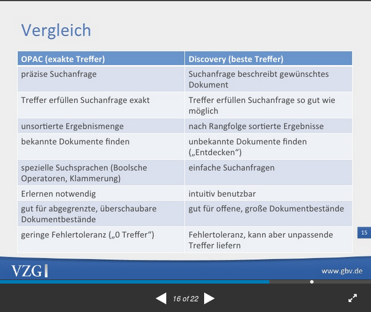
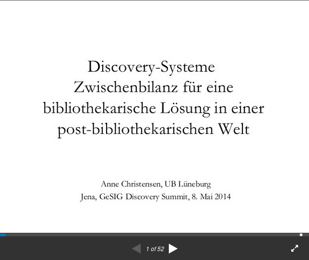
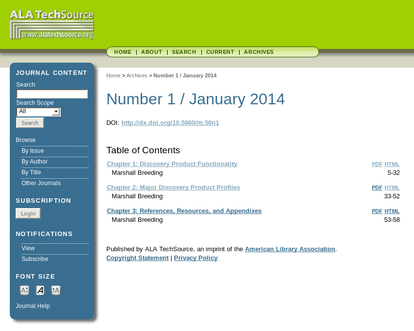

# 1.1 Einführung ins Thema

In diesem praxisorientierten Kurs setzen Sie Open-Source-Komponenten ein, um einen Prototyp eines Katalogs \(Discovery-System\) herzustellen. Ausgehend vom Laden ausgewählter Metadaten über Schnittstellen, transformieren Sie die Metadaten in ein für Suchmaschinen geeignetes Format, konfigurieren einen Suchindex und erstellen eine prototypische Anzeige eines Katalogs. Durch die konkrete Arbeit mit den Technologien und Beispieldaten lernen Sie die Funktionsweise typischer Software, Schnittstellen und verschiedene Metadatenformate kennen.

## Fragen

* Was unterscheidet Discovery-Systeme von vorherigen Bibliothekskatalogen \(OPACs\)?
* Discovery-Systeme gibt es schon seit etwa 10 Jahren, wo stehen wir heute? Was sind aktuelle Probleme und Lösungsansätze?
* Welche Software gibt es auf dem Markt?

## Vergleich zwischen OPAC und Discovery von Gerald Steilen \(2012\)

Quelle: [http://www.slideshare.net/steilen/discoverysysteme-die-opacs-der-zukunft](http://www.slideshare.net/steilen/discoverysysteme-die-opacs-der-zukunft)

Der klassische Bibliothekskatalog \(Online Public Access Catalogue, kurz: OPAC\) wird von NutzerInnen nur noch selten als erster Einstieg gewählt. Gerald Steilen zitiert aus einer Studie von 2009 die folgenden Gründe:

* schlechte Nutzbarkeit
* hohe Komplexität
* fehlende Integration elektronischer Ressourcen

Die Einführung von Discovery-Systemen erfolgte im deutschprachigen Raum etwa **seit Ende der 2000er Jahre** und sollte diesen Kritikpunkten begegnen. Discovery-Systeme versuchen die von Google und anderen Internetsuchmaschinen bekannte Suchfunktionalität \(ein Suchschlitz und nach Relevanz sortierte Treffer\) auf Bibliothekskataloge zu übertragen und auch elektronische Medien in einer übergreifenden Suche mit einzubeziehen.

Während OPACs eher auf möglichst exakte Suchergebnisse zielen, liefern Discovery-Systeme sehr viele Suchergebnisse, die ähnlich wie bei anderen Suchmaschinen mittels eines Algorithmus **nach Relevanz sortiert** werden. Der Algorithmus ist meist nicht besonders kompliziert und zählt einfach das Vorkommen der Suchbegriffe in den Katalogeinträgen. Treffer in bestimmten Feldern wie Titel und Autor/in sind mehr wert als Treffer im Beschreibungstext oder in Verlagsangaben. Daraus errechnet die Suchmaschine einen Ergebniswert und sortiert die Trefferliste entsprechend.

Gerald Steilen weist in seinem Vergleich \(Folie 16/17\) auf wichtige Unterschiede der beiden Konzepte hin. Der klassische OPAC folgt dem Paradigma "exact match", während Discovery-Systeme dem Paradigma "best match" folgen. Während beim OPAC die NutzerInnen ihre Suchanfrage präzise formulieren müssen und dazu den Katalog und den Bibliotheksbestand gut kennen müssen, können NutzerInnen beim Discovery-System auch ohne besonderes Vorwissen nach beliebigen Begriffen suchen und erhalten eine sortierte Trefferliste. Durch eine hohe Fehlertoleranz werden **sehr viele Treffer** gefunden – unter denen dann aber oft auch unpassende Treffer dabei sind.

Discovery-Systeme versprechen eine intuitive Nutzbarkeit. Das bedeutet aber nicht, dass die Systemeinführung ebenso "von der Stange" funktioniert. Es ist wichtig, das System richtig zu konfigurieren und auf die Bibliotheksbestände anzupassen. Um gute Filtermöglichkeiten \(Facetten\) anbieten zu können, **müssen Felder in den Metadaten identifiziert werden, die geeignet und einheitlich belegt sind** . Gegebenenfalls sind die Katalogeinträge vorher nachzubearbeiten oder zu bereinigen.

Die Systemarchitektur von Discovery-Systemen **lässt sich konzeptionell in eine Suchmaschine und eine Oberfläche/Webseite trennen** . In der Suchmaschine werden die Katalogeinträge indexiert. Die NutzerInnen rufen die Webseite mit der Katalogoberfläche auf und geben dort ihre Suchanfrage ein. Im Hintergrund gibt die Oberfläche die Anfrage an die Suchmaschine weiter und erhält von dieser ein Ergebnis \(eine Trefferliste\) zurück. Die NutzerInnen hingegen erhalten dieses Ergebnis grafisch aufbereitet auf der Webseite der Katalogoberfläche.

Funktionen zur Ausleihe, zur Verwaltung des Benutzerkontos und zur Anzeige von aktuellen Verfügbarkeitsinformationen sind oft nicht direkter Bestandteil des Discovery-Systems, sondern Teil des "Lokalsytems" \(vgl. Folie 19\). Damit ist das System gemeint, in dem die Bibliothek "verwaltet" wird, also in dem die Ausleihe, die Erwerbung und die Katalogisierung stattfindet. **Discovery-System und Lokalsystem kommunizieren über eine Schnittstelle** miteinander, so dass die Informationen aus dem Lokalsystem im Katalog live angezeigt werden können \(beispielsweise der Ausleihstatus von Büchern\).

## Zwischenbilanz von Anne Christensen \(2014\)

Quelle: [http://www.slideshare.net/xenzen/discoverysysteme-zwischenbilanz-fr-eine-bibliothekarische-lsung-in-einer-postbibliothekarischen-welt](http://www.slideshare.net/xenzen/discoverysysteme-zwischenbilanz-fr-eine-bibliothekarische-lsung-in-einer-postbibliothekarischen-welt)

Anne Christensen konstatiert den Monopolverlust der Bibliotheken und zitiert eine Studie von OCLC aus dem Jahr 2005, in dem nur 2% der College Students ihre Suche nach elektronischen Informationen auf der Webseite der Bibliothek beginnen. Daraufhin stellt sie die \(rhetorische\) Frage, ob es sich bei der Einführung von Discovery-Systemen nur um ein "Rückzugsgefecht" handle und angesichts der Dominanz von Suchmaschinen wie Google das "Thema Suche" von Bibliotheken ganz aufgegeben werden sollte.

Sie spricht sich dafür aus, das Thema Discovery-Systeme in Bibliotheken weiter zu behandeln. Die Herausforderung für Bibliothekarinnen und Bibliothekaren bezeichnet sie als einen schmalen Grat mit dem **Ziel "bibliothekarisches Know-How sichtbar \(zu\) machen und aus\(zu\)spielen" und gleichzeitig "Bibliothekarische Vorstellung los\(zu\)lassen".**

Für die Probleme der Bibliotheken mit Discovery-Lösungen \(zu vereinfacht, zu viel, zu ungenau und zu obskur\) schlägt sie zwei Lösungsansätze vor:

1. Klarheit über Architektur und Funktionsweise von Discovery-Systemen gewinnen
2. Klarheit über grundverschiedene "mentale Modelle" gewinnen \(denjenigen von BibliothekarInnen und NutzerInnen\)

Sie plädiert für einen pragmatischen Ansatz und **Ausrichtung der Suchoberflächen nach Nutzerwünschen** . So ist beispielsweise das Angebot von Delivery-Optionen \(elektronisch, sofort ausleihbar, ausleihbar/wartezeit, Fernleihe\) sehr wichtig.

Als Verbesserungsmöglichkeiten für aktuelle Discovery-Systeme \(Präsentation von 2014\) spricht sie an:

* Verbesserung des Rankings,
* Nutzung von Normdaten,
* Zusammenspiel zwischen Bibliothekssystem, Discovery System und 
  **Link-Resolvern**

Mittelfristig haben aus ihrer Sicht weder lokale Bibliothekskataloge noch lokale Discovery-Lösungen eine Zukunft, weshalb die Definition von Austauschformaten für Lizenzinformationen sehr wichtig ist.

Weil Discovery viele bibliothekarische Kernthemen betrifft \(sie nennt Katalogisierung, Authoritäts- und Qualitätskontrolle, Bestandsentwicklung, Informationskompetenz-Vermittlung\) sei die Beschäftigung damit ein guter Ansatzpunkt, "wenn man eine bibliothekarische Zukunft gestalten will".

## Marktüberblick von Marshall Breeding \(2014\)

Quelle: [https://journals.ala.org/ltr/issue/view/195](https://journals.ala.org/ltr/issue/view/195)

Der Autor Marshall Breeding schreibt seit längerer Zeit zusammenfassende Berichte über den Stand von IT-Systemen in Bibliotheken und hat insbesondere über die Entwicklung von Discovery-Systemen berichtet. Er war von 1985 bis 2012 in einer Bibliothek in den USA tätig und ist gleichzeitig seit 1985 als IT-Berater tätig. Durch seine Arbeit ist er den kommerziellen Anbietern recht nah und kann daher einen guten Marktüberblick geben, gleichzeitig ist er nicht völlig unabhängig, was bei der Rezeption der Texte zu beachten ist.

Sein umfassender Bericht von 2014 in der Zeitschrift ALA TechSource bietet einen guten Einstieg. Den Ergebnissen der Befragung ist zu entnehmen, dass den Markt in den USA **nur wenige Anbieter** prägen. Bei wissenschaftlichen Bibliotheken sind dies 2014 insbesondere:

* Ex Libris: Primo / Primo Central
* ProQuest: Summon
* OCLC: WorldCat local
* EBSCO: EBSCO Discovery Service
* iii: Encore \(auf Basis von EBSCO Discovery Service\)

Es gibt zwar noch eine Reihe von anderen Anbietern, aber diese sind vor allem an kleineren Einrichtungen oder mit geringen Installationszahlen auf dem Markt für wissenschaftliche Bibliotheken tätig. Open-Source-Systeme wie VuFind sind ebenfalls noch recht wenig verbreitet.

Von großer Bedeutung sind die **von den Anbietern aufgebauten Indizes mit elektronischen Artikeln** , die zusammen mit dem Discovery-Produkt, manchmal aber auch allein lizenziert werden können. Die Anbieter übernehmen dabei die Aufgabe, die Metadaten zu lizenzpflichtigen und lizenzfreien Online-Ressourcen aus verschiedenen Quellen zusammenzutragen und zu normalisieren. Der daraus resultierende "Gesamtindex" wird dann mit den Lizenzen der Kunden \("Holdings"\) abgeglichen und im Discovery-System integriert oder in einem separaten Suchraum "Elektronische Artikel" oder ähnlich bereitgestellt.

Zum genaueren Verständnis der Funktion des Gesamtindex \("Central Index"\) ist ergänzend der folgende Artikel von Athena Hoeppner von 2012 hilfreich: [The Ins and Outs of Evaluating Web-Scale Discovery Services](http://www.infotoday.com/cilmag/apr12/Hoeppner-Web-Scale-Discovery-Services.shtml) . In: Computers in Libraries, April 2012.

## **Neuere Entwicklungen**

Seit dem Artikel aus 2014 hat im Zuge der Einführung von Cloud-Lösungen und durch eine große Übernahme eine weitere Marktkonzentration stattgefunden:

* **ProQuest hat Ende 2015 Ex Libris aufgekauft.** Die beiden Produktlinien Summon und Primo existieren derzeit noch parallel, werden aber vermutlich zukünftig zusammengeführt.
* Ex Libris Primo wird mittlerweile vor allem in Kombination mit ALMA \(einem kompletten Bibliothekssystem\) als **Cloud-Lösung ** verkauft. Das gleiche gilt für OCLC, die ihre Cloud-Lösung WorldShare Management Services als neues Hauptprodukt bewerben.
* OCLC und Ex Libris verfolgen beide das Ziel den **Austausch von Metadaten vor allem innerhalb ihrer Kundschaft **zu forcieren. So gibt es bei ALMA eine "Common Bibliographic Data Zone" und bei OCLC die Integration des "WorldCat". Durch die Verfügbarkeit von geteilten Metadaten zur Katalogisierung und Erwerbung innerhalb der Systeme versprechen die Firmen den Bibliotheken Arbeitserleichterungen und sich selbst einen Marktvorteil. In Kombination mit der engen Kopplung der Bibliothekssysteme mit den Discovery-Systemen und der Angebote als Cloud-Lösungen entstehen hohe Abhängigkeiten. Ein Wechsel zwischen den Anbietern oder die Nutzung einzelner Komponenten wird erschwert. Das führt zu einem [**Vendor-lockin**](https://en.wikipedia.org/wiki/Vendor_lock-in).
* EBSCO ist nicht nur Anbieter von Bibliothekssoftware, sondern betreibt auch Fachdatenbanken. In Konkurrenz zu anderen Anbietern versucht EBSCO daraus einen Vorteil zu gewinnen, indem es die Inhalte der Fachdatenbanken bevorzugt im eigenen Discovery-System-Index verfügbar macht. Darüber ist **2013-2015 ein Streit mit Ex Libris** entbrannt, woraufhin Kunden von Ex Libris versucht haben eine Einigung herbeizuführen \(siehe Zusammenfassung der ORBIS CASCADE ALLIANCE, einem Zusammenschluss von amerikanischen Universitätsbibliotheken: [https://www.orbiscascade.org/ebsco-ex-libris/](https://www.orbiscascade.org/ebsco-ex-libris/)\).
* Um den Komplettlösungen von OCLC und Ex Libris zu begegnen, hat EBSCO zudem Mitte 2016 [in das Open-Source-Projekt Kuali OLE investiert](https://www.ebsco.com/e/de-de/nachrichten-center/pressemitteilungen-in-deutscher-sprache/folio-die-neue-kooperation-bringt-bibliotheken-dienstleister-und-entwickler) und dieses unter neuem Namen [FOLIO](https://www.folio.org) herausgebracht. Zusammen mit der Firma Index Data wird eine Alternative zu den Komplettlösungen von Ex Libris und OCLC entwickelt. Ob der angekündigte Weg der Open-Source-Community tatsächlich in Reinform eingehalten wird oder doch Abhängigkeiten geschaffen werden, bleibt noch abzuwarten.

 Marshall Breeding schreibt regelmäßig Berichte unter dem Titel "Library Systems Report". Der diesjährige [Artikel von 2016](https://americanlibrariesmagazine.org/2016/05/02/library-systems-report-2016/) ist mit "Power plays" untertitelt. Das spielt auf die oben beschriebene **zunehmende Marktkonzentration** an.

 Es gibt Bestrebungen, die Discovery-Systeme möglichst unabhängig von Bibliothekssystemen einsetzbar zu halten und zu gewährleisten, dass wissenschaftliche Inhalte unabhängig von Marktinteressen in allen Discovery-Systemen nachgewiesen werden können. In den USA hat die [**"Open Discovery Initiative \(ODI\)"**](https://www.niso.org/standards-committees/odi) des Standardisierungsgremiums NISO eine umfangreiche Empfehlung dazu herausgegeben: [NISO RP-19-2014: A Recommended Practice of the National Information Standards Organization](https://www.niso.org/publications/rp-19-2014-odi).

