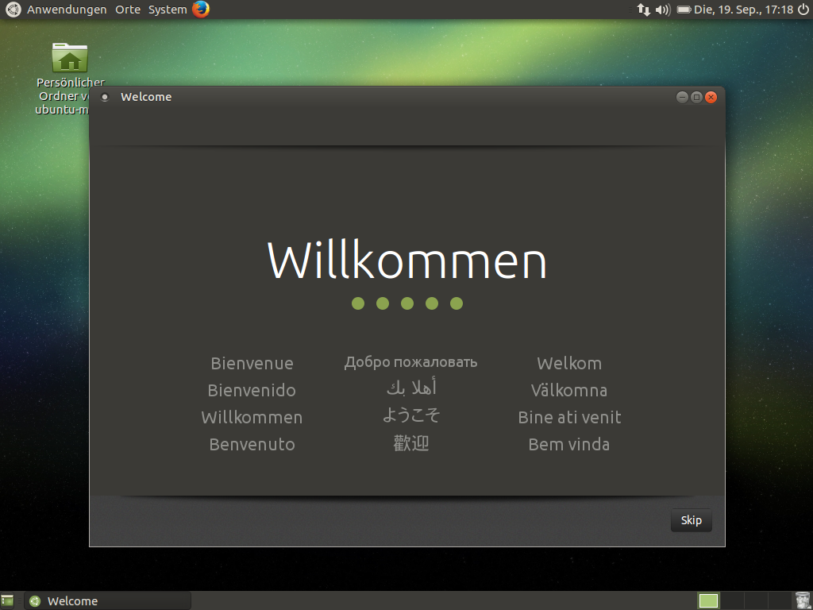

# 1.2 Installation der Arbeitsumgebung

Wir arbeiten mit dem Linux-Betriebssystem [**Ubuntu MATE**](https://ubuntu-mate.org/)** 16.04** LTS. Wir nutzen eine "Live"-Version mit persistentem Storage. Dadurch gibt es folgende Besonderheiten:

* Änderungen am System und eigene Daten werden in der Partition "**casper-rw**" gespeichert.
* Die Partition "**usbdata**" kann zum Datenaustausch genutzt werden. Sie ist mit dem Dateisystem NTFS formatiert und kann auch auf einem Windows-Rechner eingelesen werden.
* Der Live-Session-User heißt "**ubuntu-mate**" und hat kein Passwort.

Im Kurs verwenden wir **vorbereitete USB-Sticks**, um das System auf eigenen Laptops zu booten.

Wer dieses Skript im **Selbststudium außerhalb der HTW Chur** bearbeiten möchte, der kann sich die Software [VirtualBox](https://www.virtualbox.org/wiki/Downloads) \(kostenfrei erhältlich für Windows, MacOS und Linux\) installieren und die folgende Appliance herunterladen und importieren \(VirtualBox Manager aufrufen, STRG+I drücken und Datei auswählen\): [https://felixlohmeier.de/htw/htw-usb.ova](https://felixlohmeier.de/htw/htw-usb.ova) \(2,9 GB\)

## Schritt 1: Von USB-Stick booten

Hinweise für verschiedene Betriebssysteme:

* **Windows 7/10**: Neu starten und während des Bootvorgangs die Tasten F2, F8, F10, F12, ENTF/DEL oder Esc \(je nach Computer unterschiedlich\) drücken. In den UEFI-Einstellungen bzw. im BIOS die Bootreihenfolge ändern oder explizit vom USB-Stick starten.
* **Windows 8**: Windows-Taste + I, Umschalt-\(Shift-\)Taste gedrückt halten und Neustart wählen. Im Menü Problembehandlung / Erweiterte Optionen / UEFI-Firmwareeinstellung. Dort "Ein Gerät verwenden".
* **macOS**: Während des Bootvorgangs die "Alt"-Taste gedrückt halten.

## Schritt 2: Internetverbindung herstellen

siehe WLAN-Symbol oben rechts

## Schritt 3: Freien Arbeitsspeicher und verfügbaren Speicher in Dateisystemen prüfen

siehe Anwendungen / Systemwerkzeuge / MATE-Systemüberwachung

