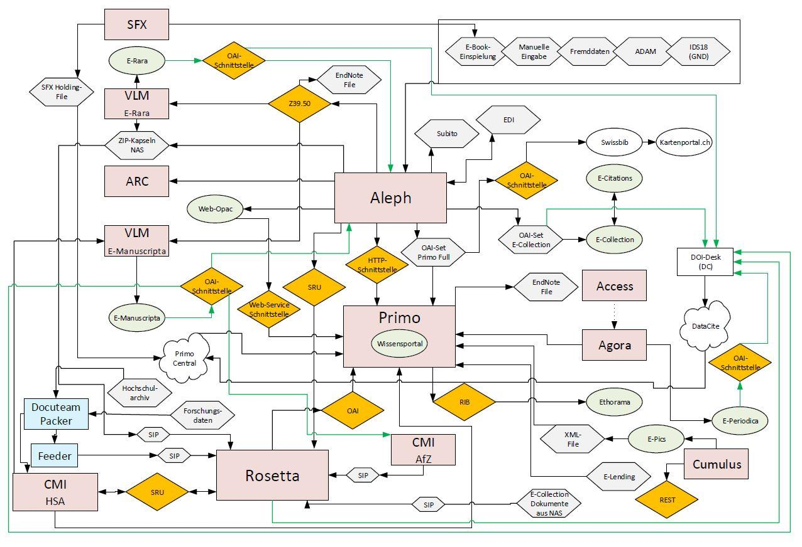

# 2.1 Metadatenflüsse der ETH-Bibliothek

Mit zunehmenden Anforderungen an die Verwaltung und Präsentation von Bibliotheks- und Archivressourcen wurden im Laufe der Zeit zahlreiche neue Systeme an der [ETH-Bibliothek](https://www.library.ethz.ch) eingeführt. Es war nicht mehr möglich alle Ressourcen ausschließlich im integrierten Bibliothekssystem bzw. im Archivinformationssystem zu verwalten. Heute gibt es eine Trennung unter anderem zwischen Metadatenhaltung (getrennt für Bibliotheks- und Archivressourcen), Discovery, Online-Präsentation und digitaler Langzeitarchivierung.

## Produkte an der ETH-Bibliothek

Folgende zentrale Produkte werden derzeit an der ETH-Bibliothek eingesetzt:

* Integriertes Bibliothekssystem: [Aleph](http://www.exlibrisgroup.com/de/category/ExLibrisAleph)
* Archivinformationssystem): [CMISTAR](https://www.cmiag.ch/cmistar)
* Discovery-System: [Primo](http://www.exlibrisgroup.com/de/category/Primo)
* Online-Präsentation von Digitalisaten: [Visual Library](https://www.semantics.de/visual_library/)
* Digitale Langzeitarchivierung: [Rosetta](http://www.exlibrisgroup.com/de/category/Rosetta)

## Datenfluss von Quellsystemen ins "Wissensportal"

Die Metadaten der ETH-Bibliothek werden in mehreren Quellsystemen verwaltet. Um eine übergreifende Suche für die Nutzer zu ermöglichen, werden alle Ressourcen im Discovery-System Primo (an der ETH "[Wissensportal](http://www.library.ethz.ch/de/)" genannt) zusammengeführt.

Das erfordert eine Transformation der Daten in einheitliches Format. Dieser Prozess der Vereinheitlichung wird auch "Normalisierung" genannt.

## Metadatenflussdiagramm der ETH Bibliothek (Stand: 1.9.2016)

Das folgende Diagramm visualisiert die Datenflüsse zwischen den Systemen.

Quelle: Judith Bisseger & Barbara Wittwer (1.9.2016): Metadatenmanagement. Die ETH-Bibliothek beschreitet neue Wege. Präsentation auf dem BIS-Kongress 2016 in Luzern. <https://www.slideshare.net/ETH-Bibliothek/metadatenmanagement-die-ethbibliothek-beschreitet-neue-wege>