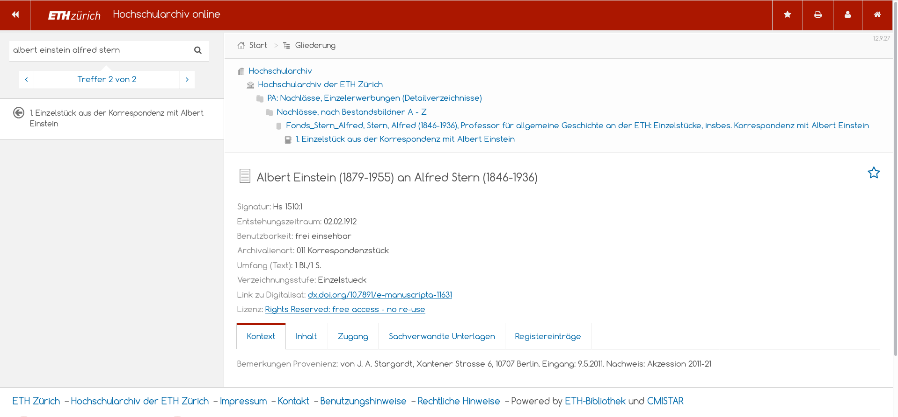

# 2.2 Datenstruktur von Archivsystemen

Als digitale Archivsysteme entwickelt wurden, orientierte sich die Datenstruktur an analogen Findmitteln wie Findbüchern und Zettelkästen. Zahlreiche Elemente dieser analogen Form der archivischen Erschliessung wirken in den Normen, die für die computergestützte Verzeichung entwickelt wurden, bis heute nach.

## Verzeichnungsstandard ISAD\(G\)

Ein wichtiger Verzeichnungsstandard im Archivwesen wurde 1994 \(Revision 2000\) eingeführt, die "International Standard Archival Description \(General\)" - kurz \[ISAD\(G\)\]\([https://de.wikipedia.org/wiki/ISAD\(G](https://de.wikipedia.org/wiki/ISAD%28G)\)\). Grundsätzlich gibt es hier eine mehrstufige Verzeichnung im Provenienzprinzip, um den Entstehungszusammenhang abzubilden.

Der Standard enthält 26 Verzeichnungselemente in 7 Informationsbereichen:

1. Identifikation
2. Kontext
3. Inhalt und innere Ordnung
4. Zugangs- und Benutzungsbedingungen
5. Sachverwandte Unterlagen
6. Anmerkungen
7. Kontrolle

Von besonderer Bedeutung sind 6 Pflichtfelder:

* Signatur
* Titel
* Provenienz
* Entstehungszeitraum
* Umfang
* Verzeichnungsstufe

Grenzen von ISAD\(G\):

1. Ein einzelner Datensatz ist unter Umständen nur im Kontext verständlich \(z. B. nur "Protokoll" als Titel\)
2. Die Tektonik ist eindimensional \(keine Mehrfachzuordnung möglich\)
3. Der Standard enthält keine Vorgaben zur Digitalisierung oder zur digitalen Langzeitarchivierung

Um Normdateien verzeichnen zu können, wurde später ein ergänzender Standard "International Standard Archival Authority Record for Corporate Bodies, Persons, and Families" - kurz \[ISAAR\(CPF\)\]\([https://de.wikipedia.org/wiki/ISAAR\(CPF](https://de.wikipedia.org/wiki/ISAAR%28CPF)\)\) verabschiedet. Dieser wird in der Praxis wegen dem Zusatzaufwand bei der Erschließung jedoch nur selten verwendet. Die ETH-Bibliothek führt Register für Personen, Körperschaften, Orte und Sachen auch im Archivbereich nach bibliothekarischen Regeln, d.h. mit Rollenkennzeichnung nach RDA und Verzeichnung von GND-IDs.

Aktuell ist ein neuer Standard "Records in Contexts" \([RIC](https://de.wikipedia.org/wiki/Records_in_Contexts)\) in Entwicklung. Dieser zielt auf eine Weiterentwicklung in Richtung Linked Data und soll neue und mehrfache Beziehungen zwischen Entitäten ermöglichen. Bis dieser neue Standard in Archivsystemen verwendet wird, werden jedoch voraussichtlich noch einige Jahre vergehen.

## Archivinformationssysteme

Der Markt in der Schweiz wird von den Produkten [scope.Archiv](http://www.scope.ch) und [CMISTAR](https://www.cmiag.ch/cmistar) dominiert. An der ETH-Bibliothek wird das Produkt CMISTAR eingesetzt. Es ist Grundlage des [Hochschularchivs der ETH Zürich](http://www.library.ethz.ch/Ressourcen/Archivalien-Dokumentationen/Hochschularchiv-der-ETH-Zuerich), des [Thomas-Mann-Archivs](http://www.tma.ethz.ch/) und des [Max Frisch-Archivs](http://www.mfa.ethz.ch/). Als Datenmodell kommt der genannte ISAD\(G\)-Standard zum Einsatz.

Das System bietet Möglichkeiten zum Import von Daten \(z.B. bei Retroerfassung auf Basis von Excel\) sowie einen parametrisierbaren Datenexport über ein Publikationsmodul, das XML-Dateien generiert. Dieser Datenexport wird in das "Wissensportal" der ETH-Bibliothek eingespielt.

Hier ein Beispiel aus dem Hochschularchiv der ETH Zürich, aus der die Verzeichnungsstruktur ersichtlich ist:

## Übung: Ein Vergleich aus Nutzersicht

Suche nach:

1. «Einstein» im [Online Archivkatalog des Staatsarchivs BS](https://query.staatsarchiv.bs.ch/query/suchinfo.aspx)
2. «Einstein Ehrat» in der [Archivdatenbank Online, Hochschularchiv ETH Zürich](http://archivdatenbank-online.ethz.ch)

Beantworten Sie für sich die folgenden Fragen:

* Welche Informationen werden auf der Trefferliste präsentiert?
* Welche Verzeichnungsstufen sind vertreten?
* Sind die ISAD\(G\)-Informationsbereiche erkennbar?
* Decken sich die grundlegenden Informationen oder gibt es bemerkenswerte Unterschiede?
* Worin liegen die zentralen Unterschiede zu einem Bibliothekskatalog?

