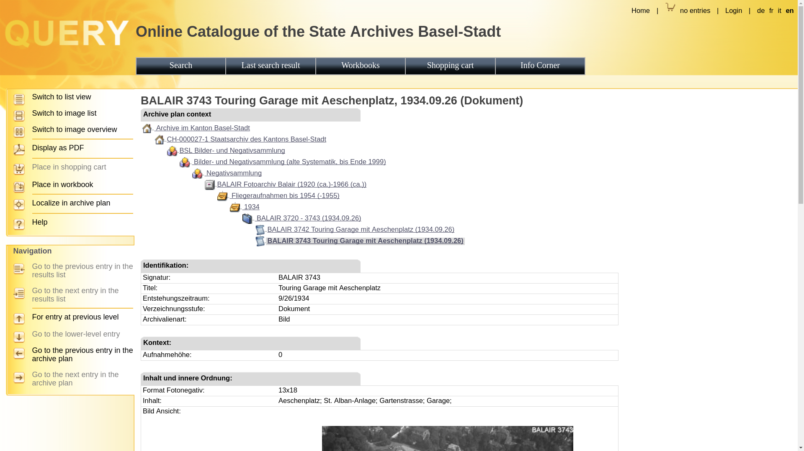
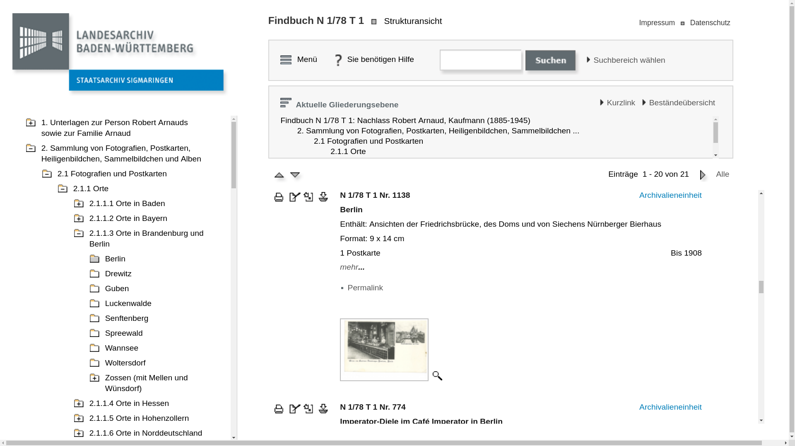
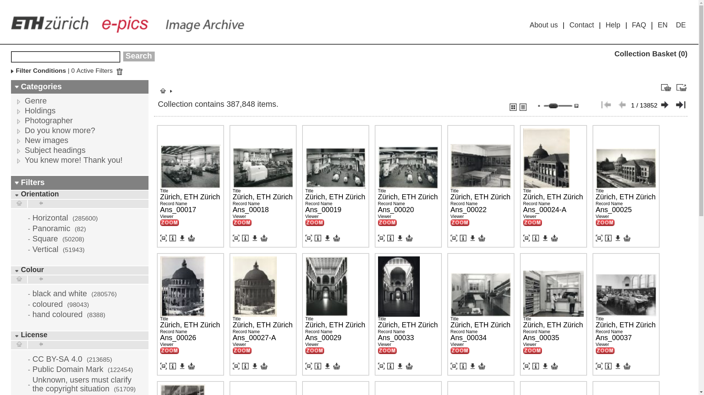
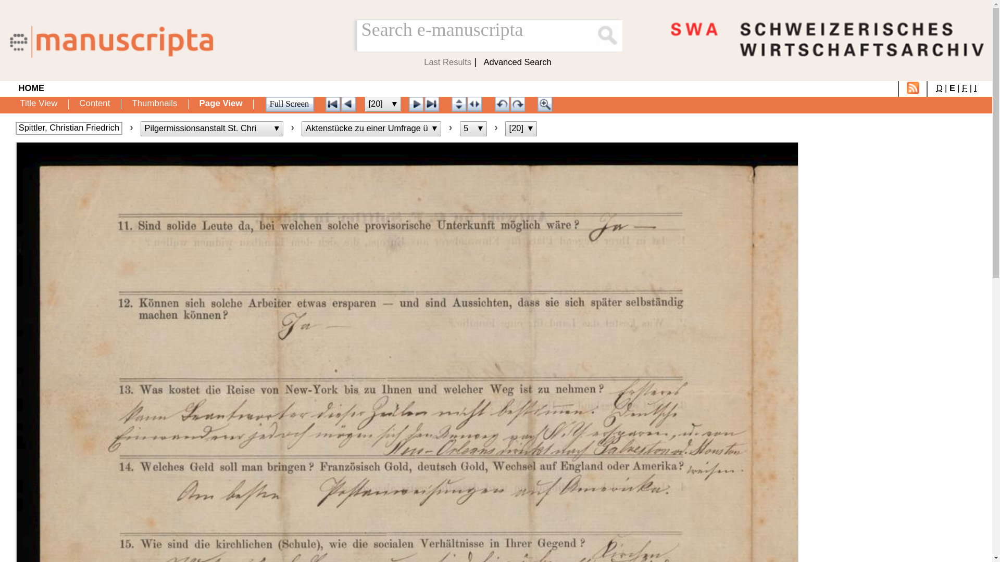

# 2.3 Online-Präsentation von Digitalisaten

Für die Präsentation der Digitalisate kommen an der ETH-Bibliothek verschiedene spezialisierte Systeme zum Einsatz. Diese verfolgen unterschiedliche Ansätze abhängig von Medienform und Zielgruppe.

## Präsentation im Archivinformationssystem

* Vorschaubild in der Treffer- und/oder Detailansicht
* Viewer für Zusatzfunktionen (Zoom, Druck, Download etc.)

### Beispiel [Staatsarchiv Basel-Stadt](https://query.staatsarchiv.bs.ch/query/detail.aspx?ID=84077)

### Beispiel [Landesarchiv Baden-Württemberg](https://www2.landesarchiv-bw.de/ofs21/olf/struktur.php?bestand=20501&sprungId=1412361&letztesLimit=suchen)

## Präsentation in Digital Asset Management Systemen

Für Anzeige und Zugriff auf digital assets optimiert:

* Hohe Skalierbarkeit
* Download in unterschiedlichen Auflösungen
* Download in Abhängigkeit vom Rechtevermerk

### Beispiel [E-Pics Plattform der ETH Zürich](https://www.e-pics.ethz.ch/de/home/)

[Bildarchiv Online](http://ba.e-pics.ethz.ch) mit rund 390’000 Digitalisaten (Stand Ende September 2017):

## Präsentation von Handschriften und alten Drucken

### Beispiel [e-manuscripta.ch](http://www.e-manuscripta.ch) - Kooperative Präsentationsplattorm für handschriftliche Quellen

* Digitalisate aus mehreren Instiutionen (ZB Zürich, UB Basel, ETH-Bibliothek u. a. m.)
* Höheres Volumen stärkt Sichtbarkeit und Attraktivität
* Geteilte Kosten für Betrieb und Weiterentwicklung
* Koordination: ZB Zürich, Hosting: ETH-Bibliothek
* Laufendes Projekt: Erweiterung um ein crowdfähiges Transkriptionsmodul
* System: Visual Library der Firma semantics GmbH
* Angebundene Quellsysteme (mit Rückverlinkung):
    * Aleph, Modul des Verbundes Handschriften, Archive, Nachlässe (HAN)
    * scopeArchiv (Schweizerisches Literaturarchiv)
    * CMISTAR (Hochschularchiv der ETH Zürich)
* analog dazu [e-rara.ch](http://www.e-rara.ch/) für alte Drucke

