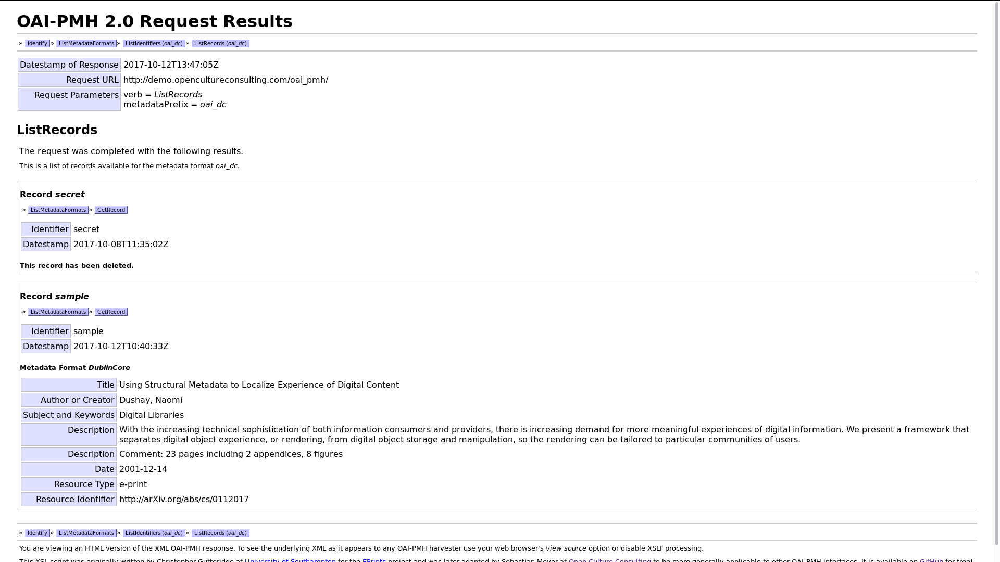

# 2.5 Datenbereitstellung für externe Portale

## Ziele

* Mehrwert für Benutzende schaffen: Übergreifende Suche
* Eigene Sichtbarkeit und Reichweite erhöhen
* Dahin gehen, wo die Nutzer sind

## Beispiel Archivportale

Es existiert eine facettenreiche (Archiv-)Portallandschaft. Ein Überblick ist kürzlich (September 2017) im [Whitepaper Portale](http://vsa-aas.ch/ressourcen/zugang-und-vermittlung/whitepaper-portale/) des Vereins Schweizerischer Archivarinnen und Archivare erschienen.

Der Fokus der ETH-Bibliothek liegt auf dem Bereitstellen einer OAI-PMH-Schnittstelle, damit Portale die Daten "einsammeln" können. Für die Integration der Daten ins Portal [Archives Portal Europe](https://www.archivesportaleurope.net) generiert die Archivsoftware CMISTAR das Format EAD2002 und bietet es über eine OAI-PMH-Schnittstelle an. Das Archives Portal Europe sammelt diese Daten dann regelmäßig ein.

## OAI-PMH

Im Jahr 2000 hat die internationale [Open Archives Initiative](http://www.openarchives.org/) ein Protokoll verabschiedet, um die Interoperabilität zwischen Repositorien von Bibliotheken zu verbessern. 

Das OAI Protocol for Metadata Harvesting ([OAI-PMH](https://www.openarchives.org/OAI/openarchivesprotocol.html)) organisiert den Datenaustausch zwischen Data Providern und Service Providern und bietet unter anderem folgende Funktionen:

* Anfrage: Einfaches Set an OAI-PMH requests (ListRecords, GetRecord ...)
* Antwort: XML-codierte Ausgabe
* Selektives Harvesting dank Zeitstempel (z. B. alle Datensätze ab dem 29.09.2017)
* Format der Datensätze kann unterschiedlich sein: Dublin Core, MARC, EAD usw.

## Beispiel einer OAI-PMH-Schnittstelle

Es gibt viele verschiedene Software-Implementierungen des OAI-PMH-Standards. Eine [Übersicht von Tools](https://www.openarchives.org/pmh/tools/) wird auf der Webseite der Open Archives Initiative geführt.

Repositoriensoftware wie die Archivsoftware CMISTAR haben oftmals eine OAI-PMH-Schnittelle integriert. Es gibt aber auch einige einfache Implementierungen. Hier ein [Beispiel](http://demo.opencultureconsulting.com/oai_pmh/?verb=ListRecords&metadataPrefix=oai_dc):

