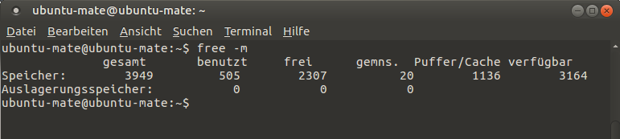
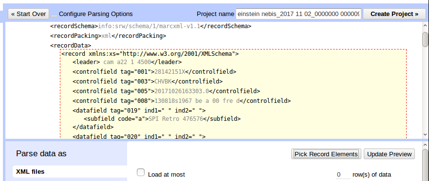
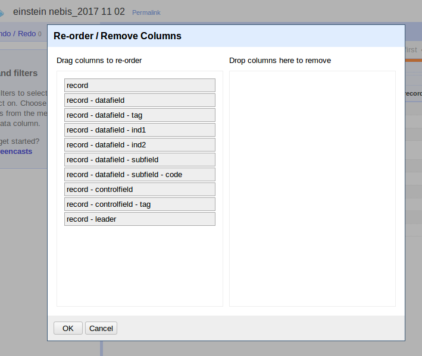
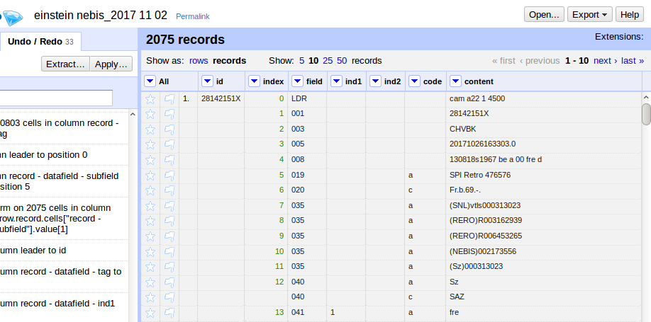

# 3.5 Verarbeitung von MARC21 mit OpenRefine

Ein möglicher Weg zum Laden von Metadaten in den Suchindex Solr ist die Transformation der umfangreichen bibliothekarischen Metadaten in eine klassische Tabellenstruktur mit wenigen Spalten, in denen wir die für die Suche relevante Daten zusammenführen:

* Spaltenüberschriften werden zu Feldern im Suchindex
* Mehrere Werte in einer Tabellenzelle können mit einem Trennzeichen eingegeben werden \(das Trennzeichen muss eindeutig sein, darf also nicht bereits in den Daten vorkommen\)
* OpenRefine bietet als Export vorrangig CSV oder TSV an. Das kann der Suchindex Solr problemlos indexieren.

Nach der Transformation könnten die Daten beispielsweise so aussehen:

| id | Titel | AutorInnen | ... |
| :--- | :--- | :--- | :--- |
| 123 | Zur Elektrodynamik bewegter Körper | Einstein, Albert | ... |
| 299 | Albert Einstein | Ziegelmann, Horst␟Fischer, Ernst Peter␟Renn, Jürgen | ... |
| ... | ... | ... | ... |

Natürlich könnten wir auch mit einem anderen Werkzeug \(z.B. XSLT\) die Dateien direkt als XML transformieren und in den Suchindex laden, aber Tabellendaten sind eben einfach besonders übersichtlich und in dieser Struktur fallen Ungereimtheiten in den Daten sofort ins Auge. Für unsere erste Datenquelle im Discovery-System also eine gute Übung.

## Eigenes Schema oder einem Metadatenstandard folgen?

Es ist sicher klar, dass wir nicht die umständlichen MARC-Zahlen und Codes als Spaltennamen in unseren Katalog übernehmen wollen, sondern sprechende Namen wie TItel, AutorInnen und so weiter. Doch welche Daten brauchen wir in welcher Form für den Katalog?

Überlegen Sie:

* Welche Informationen wollen Sie in Ihrem Bibliothekskatalog anbieten?
* Wer soll die Hauptzielgruppe sein?
* Welche Filtermöglichkeiten \(Facetten\) wollen Sie anbieten?
* Welche Kurzinformationen \(Unterscheidungsmerkmale\) sollen in der Trefferliste stehen?
* Welche Informationen sollen in der Vollanzeige dargestellt werden?

Wenn Sie ein innovatives Discovery-System auf Basis von verschiedenen heterogenen Datenquellen bauen wollen, dann kann auch die absichtliche Reduktion auf wenige Felder helfen \("Simplicity"\). Wichtig für das Nutzererlebnis \("User Experience"\) ist, dass die Felder konsistent belegt sind und Trefferliste und Facetten nützliche und eindeutige Unterscheidungsmerkmale beinhalten. Bei der Datentransformation haben Sie die Chance einige Unstimmigkeiten zu bereinigen und Informationen clever zu aggregieren, so dass die Daten trotz verschiedener Quellen einigermaßen einheitlich durchsuchbar sind.

Haben Sie eigene Vorstellungen? Falls nicht, dann orientieren Sie sich an [Dublin Core](http://dublincore.org/documents/dces/), denn diese Initiative hatte von Beginn an das Ziel, einen gemeinsamen Mindeststandard zu definieren und entsprechend übersichtlich sind die Felder. Wenn Sie noch nicht mit MARC gearbeitet haben und die passenden Zahlen und Codes nicht im Kopf haben, dann orientieren Sie sich an der [Empfehlung der Library of Congress für einen "MARC to Dublin Core Crosswalk"](https://www.loc.gov/marc/marc2dc.html).

## Aufgabe 1: Testdaten importieren und zur weiteren Bearbeitung umstrukturieren

### Arbeitsspeicher für OpenRefine freigeben

Für das Laden und Transformieren der 2075 Beispieldatensätze benötigt OpenRefine etwa 1,5 GB Arbeitsspeicher. Als Standardeinstellung verwendet OpenRefine jedoch maximal 1,4 GB Arbeitsspeicher. Wenn während der Transformation der Speicher ausgeht, wird OpenRefine erst sehr langsam und stürzt dann irgendwann ab.

Wieviel freien Arbeitsspeicher Sie zur Verfügung haben, bestimmen Sie am besten, indem Sie alle Fenster bis auf den Browser schließen und dann in der Kommandozeile den Befehl ```free -m``` eingeben. In der Spalte "verfügbar" können Sie ablesen, wieviel MB maximal noch zur Verfügung stehen.

 

Ziehen Sie von diesem Wert zur Sicherheit mindestens 300 MB ab. Das Ergebnis ist der Höchstwert, den Sie OpenRefine zuordnen können.

Um jetzt das Limit zu erhöhen, bearbeiten wir die Einstellungsdatei von OpenRefine. Öffnen Sie die Datei ```refine.ini``` mit einem Texteditor (hier: Anwendungen / Zubehör / Pluma Text Editor) und ändern Sie den Wert in der Zeile ```REFINE_MEMORY=1400M``` auf ```2000M``` und speichern Sie die Datei (```STRG``` und ```S```).

Wenn Sie über genügend freien Arbeitsspeicher verfügen, können Sie auch gleich ein höheres Limit setzen. Falls Sie nicht genügend freien Arbeitsspeicher haben, um das Limit zu erhöhen, dann bleibt Ihnen nichts anderes übrig als die Anzahl der zu verarbeitenden Daten zu reduzieren. Sie könnten im Folgenden beispielsweise nur einen Teil der heruntergeladenen XML-Dateien importieren.

Weitere Informationen: <https://github.com/OpenRefine/OpenRefine/wiki/FAQ:-Allocate-More-Memory#linux-or-mac>

### Daten importieren

* Im Menüpunkt "Create Project" auf den Button "Durchsuchen" klicken, in den Ordner Downloads wechseln und alle der im vorigen Kapitel gespeicherten XML-Dateien (```einstein-nebis```...) auswählen. Mehrere Dateien können Sie, wie sonst auch üblich, mit der Taste Shift markieren (oberste XML-Datei anklicken, Shift gedrückt halten und unterste XML-Datei anklicken). Das Protokoll zum Download (Dateiendung ```.log```) können wir nicht gebrauchen.

* Im nächsten Bildschirm könnten Sie von den ausgewählten Dateien noch wieder welche abwählen. Das ist aber nicht nötig. Klicken Sie gleich weiter oben rechts auf den Button "Configure Parsing Options".

* Im letzten Bildschirm können Sie nun Einstellungen vornehmen, wie die XML-Dateien von OpenRefine interpretiert werden sollen. Gehen Sie wie folgt vor:

    * Klicken Sie als erstes im Vorschaubildschirm auf den Pfad ```<record xmlns:xs="http://www.w3.org/2001/XMLSchema">```. Es ist wichtig genau diese Stelle zu treffen. Wenn Sie mit der Maus darüber fahren, wird ein Kasten angezeigt, welche Daten OpenRefine als einen Datensatz interpretieren wird.
 

    * Nehmen Sie dann folgende weiteren Einstellungen vor:

        * Checkbox "Store file source" deaktivieren
        * Im Textfeld "Project Name" den hinteren Teil hinter dem Datum entfernen oder einen eigenen Namen vergeben

* Abschließend können Sie das neue OpenRefine-Projekt mit diesen Daten erstellen, indem Sie oben rechts den Button "Create Project" drücken.

### Daten prüfen

Klicken Sie bei der Spalte "All" auf das Dreieck und wählen Sie im Menü den Punkt Edit columns / Re-order / remove columns... aus.

So sollte die Spaltenstruktur aussehen:

 

Achtung: Die weiteren Schritte beziehen sich auf diese Spaltennamen, daher müssen Ihre Spaltenbezeichnungen zwingend mit denen vom Screenshot übereinstimmen. Falls es bei Ihnen anders aussieht, ist beim Import etwas schiefgegangen.

### Daten "massieren"

Bevor wir inhaltlich mit den MARC21-Daten arbeiten können, müssen wir diese zunächst umformen. OpenRefine "versteht" MARC21 nicht, sondern lädt die Daten wie andere XML-Dateien.

Um die MARC21-Daten so umzustrukturieren, dass sie in dem flachen Tabellenformat von OpenRefine benutzbar sind, sind zahlreiche Transformationsschritte notwendig. Damit Sie diese nicht manuell durchführen müssen, nutzen wir ein vorbereitetes Transformationsscript.

1. Rufen Sie die Datei [openrefine-marc.json](https://raw.githubusercontent.com/felixlohmeier/kurs-bibliotheks-und-archivinformatik/master/openrefine/openrefine-marc.json) im Browser auf und kopieren Sie den gesamten Inhalt in die Zwischenablage (```STRG``` und ```A``` um alles zu markieren und ```STRG``` und ```C``` um es in die Zwischenablage zu kopieren)

2. Wechseln Sie in OpenRefine in den Tab "Undo / Redo" (neben "Facet / Filter" unterhalb des OpenRefine-Logos) und klicken Sie den Button "Apply...". Fügen Sie den Inhalt der Zwischenablage in das Textfeld ein (```STRG``` und ```V```) und bestätigen Sie mit dem Button "Perform Operations".

Die Verarbeitung kann je nach Menge der Daten ein paar Minuten dauern. Anschließend ist die Struktur schon etwas handlicher. Etwa so sollte es aussehen:



## Aufgabe 2: MARC-Daten analysieren und neue Spalten für das Zielschema bilden

**Das Skript ist an dieser Stelle noch nicht vollständig ausgearbeitet. Hier eine kurze englische Anleitung, wie Sie vorgehen können. Eine ausführliche Erläuterung erfolgt spätestens bis zum 16.11.2017.**

### Statistik

* Text facet on column "field"
* Try "Blank down" on column "field" to see how many records include each MARC field
* Get a tab separated list by clicking the "... choices" link below the facet name
* Rollback the "Blank down" operation via "Undo / Redo"

### Neue Spalten erstellen

#### A\) Werte in neue Spalte kopieren

* Select row mode \(show as: rows\)
* Select values with text facets in "field" and "code" \(example: field 100 and codes a, d and q for authors\)
* Add column based on column "content" with expression `value`

#### B\) Werte in neuer Spalte transformieren

* Normalize values in new column \(e.g. search/replace\)
* Add separators \(e.g. add brackets to birth dates: select field 100 and code d and transform new column with expression `"(" + value + ")"`\)

#### C\) Werte in neuer Spalte zusammenführen

* Move column "id" to the end
* Move column "index" to the beginning
* Join multi-valued cells in new column with separator ` ` \(space\)

### Datensätze zusammenführen

* Move column "id" to the beginning
* Join multi-valued cells in each new column with separator `␟`

### Daten exportieren

* Use Export / Custom tabular exporter, select relevant columns and download file