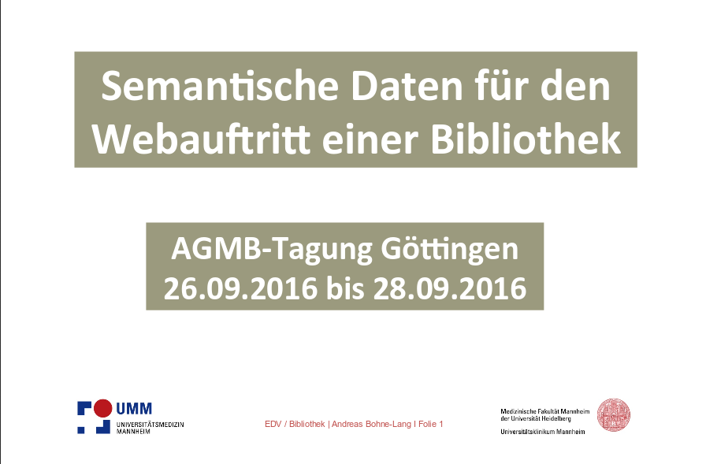

# 7.1 Semantische Daten für Webauftritt

## Wozu Linked Data?

Linked Data dient der Verknüpfung zwischen Datensilos: Der Computer kann Verweisen in den Daten folgen und Zusatzinformationen aus externen Quellen automatisch heranziehen. Ein möglicher Anwendungsfall ist die Anzeige von Zusatzinformationen im Bibliothekskatalog über Personen, die nicht in den Katalogdaten stehen und beim Aufruf live aus einer Personendatenbank geladen werden.

Der [Fachinformationsdienst Performing Arts](http://www.performing-arts.eu) nutzt den Dienst [Entity Facts der Deutschen Nationalbibliothek](http://www.dnb.de/EN/Wir/Projekte/Abgeschlossen/entityFacts.html), um Personeninformationen im Katalog anzuzeigen. Hier das [Beispiel für Johann Wolfgang von Goethe](http://www.performing-arts.eu/Search/AuthorityResults?lookfor=gnd_118540238&type=agentID):

Die Informationen im blauen Kasten über die Person Johann Wolfgang von Goethe werden live beim Aufruf der Katalogsuche über den Dienst Entity Facts geladen.

## Präsentation zu semantischen Daten von Andreas Bohne-Lang \(2016\)

Eine notwendige Voraussetzung für die Nutzung von Linked Data ist die semantische Auszeichnung der Daten mit einem übergreifenden Standard-Vokabular. Bevor wir näher auf Bibliothekskataloge eingehen, betrachten wir zunächst die Chancen für Webauftritte der Bibliotheken.

Quelle: <https://www.umm.uni-heidelberg.de/bibl/ueberuns/vortraege_folien/vortraege_bl_semandaten_agmb_2016.pdf>

Vgl. auch [Kapitel 5.5](/kapitel-5/55_suchmaschinenoptimierung.md)

## Literatur

* Danowski, Patrick; Pohl, Adrian (Hrsg.) (2013): (Open) Linked Data in Bibliotheken. <http://dx.doi.org/10.1515/9783110278736>.
* Stettler, Niklaus; Aschwanden, Michael; Mastrandrea, Elena; Süsstrunk, Norman; Wenk, Bruno (2015): Linked (Open) Data - Von der Theorie zur Praxis. <http://linkeddata.fh-htwchur.ch>.
